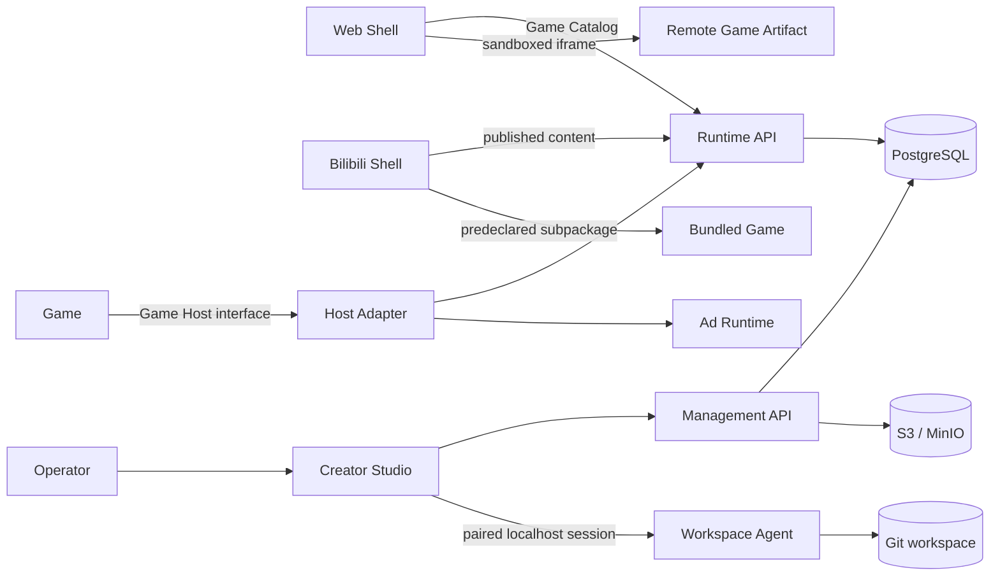

# 小游戏创作与运行平台架构

## 1. 目标

将现有单体 Vite 原型重构为可扩展的 monorepo：每个 Game 可以独立开发、构建和部署，也可以由 Web 或 B 站 Shell 承载；运营人员能够通过 Creator Studio 管理动态内容、广告、版本与 AI 生成任务；玩家侧能力由独立的 Game Runtime Service 提供。

首年按约 1 万 DAU、峰值 100 RPS 设计。架构优先优化单人或小团队的开发效率，不引入 Kubernetes、Kafka、Redis、微前端框架等尚未产生实际收益的设施。

## 2. 系统边界



两个线上服务是独立部署程序。Workspace Agent 是仅监听 `127.0.0.1` 的本地开发工具，不属于线上业务后端。

## 3. Monorepo 结构

```text
apps/
  shell-web/                 Web 合集与远程 Game 宿主
  shell-bilibili/            B 站适配、分包与平台审核入口
  studio-web/                目录树、Monaco 编辑器、内容与发布后管
  games/
    cultivation/             @coffeeeeffoc/game-cultivation
    office/                  @coffeeeeffoc/game-office
    arena/                   @coffeeeeffoc/game-arena
services/
  management-api/            @coffeeeeffoc/management-api
  runtime-api/               @coffeeeeffoc/runtime-api
tools/
  workspace-agent/           @coffeeeeffoc/workspace-agent
packages/
  game-contract/             GameDefinition、Manifest 与消息协议
  game-host/                 Host orchestration 与通用 adapters
  game-loader/               in-process、iframe、B 站分包 loaders
  content-schema/            Dynamic Content 公共 envelope
  ad-config/                 广告配置、频控与奖励规则
  ad-runtime/                展示流程与广告提供方 adapters
  shared-ui/                 真正跨 App 复用的 UI primitives
  telemetry/                 事件 envelope 与 adapters
  config-eslint/             共享代码规则
  config-typescript/         共享 TypeScript 配置
infra/
  docker/                    本地与部署镜像
  migrations/                PostgreSQL migrations
docs/
  adr/
  architecture/
  plans/
```

目录不是边界本身；每个 package 的公开 `exports` 才是 interface seam。禁止导入另一个 package 的 `src/` 或内部路径。`shared-ui` 只收纳已经出现至少两个真实调用方的内容，避免把它变成杂物箱。

## 4. Game 的两种运行方式

每个 Game package 同时提供：

1. 独立入口：轻量 Standalone Shell + Browser Game Host，可独立执行 `dev`、`test` 和 `build`。
2. 嵌入入口：导出框架无关的 `GameDefinition`，由受信任 Shell 在构建时直接装载。
3. Web Artifact：生成包含入口 HTML、资源和 Manifest 的不可变制品，供 Web Shell 通过沙箱 iframe 远程装载。
4. B 站制品：由 B 站 Shell 在构建期转换为预声明分包或独立 App 包。

Web 远程 Game 不直接进入 Shell JavaScript 上下文。iframe 使用独立 Origin、`sandbox="allow-scripts"` 和严格 CSP，通过版本化 `postMessage` 协议访问 Game Host。构建期可信 Game 可使用进程内 adapter，避免无意义的通信成本。

B 站小游戏的代码包运行后不可动态修改。B 站 Shell 可以动态获取内容 schema 与素材，但 Game 代码升级必须重新构建、审核和发布；合集使用 `game.json` 预声明分包并通过 `bl.loadSubpackage()` 加载。独立发行的 Game 使用单独 App ID，但复用相同实现。

## 5. Game Catalog 与版本

Game Artifact 使用内容哈希地址，不允许覆盖。Game Version 引用 Artifact、内容 schema 版本、兼容协议和完整性哈希。Game Catalog 暴露 `development`、`canary`、`stable` 三个 Release Channel：

- `development` 面向本地和内部预览。
- `canary` 使用用户稳定散列进行灰度，同一用户保持版本稳定。
- `stable` 是默认正式版本。
- Shell 可以显式固定某一 Game Version。
- 回滚只移动 Channel 指针，旧 Artifact 保持不可变。

远程加载依次尝试目标版本、last-known-good 缓存和 Shell 内置兼容版本。Manifest 不兼容、哈希错误或连续加载失败时熔断目标版本，不进行无限重试。

## 6. 广告架构

Game 只能向 Game Host 提交 Reward Opportunity，不能接触广告位 ID、素材、SDK 对象或完成回调。Game Session 启动时固定以下 Ad Authority：

- `host`：B 站等渠道决定广告内容与完成校验。
- `managed`：自有 Web/App 使用运营配置。
- `none`：开发预览、审核或无广告发行。

优先级为 `平台强制策略 > Shell/渠道配置 > Game 默认配置 > Reward Opportunity 参数`。`ad-config` 是纯规则模块，负责 schema、频控和奖励决策；`ad-runtime` 是深模块，以 `offer(opportunity)` interface 隐藏加载、展示、完成校验、失败降级和遥测。B 站、运营、预览和测试分别是 adapters。

## 7. 后端产品

### Management Service

Node.js + TypeScript + Fastify + Zod + Drizzle。内部模块包括本地账号、项目、Dynamic Content、AI 任务、源码任务、审核、发布、Artifact 与审计。第一阶段所有本地账号拥有 creator、reviewer、publisher、admin 权限，但权限模型仍保留。

Dynamic Content 遵循“草稿 → 校验 → 预览 → 发布版本 → 回滚”，保存不会直接影响玩家。AI Provider 采用可替换 interface，支持 schema generation、source generation、source explanation 和 source repair；密钥只保存在服务端。

### Game Runtime Service

同样使用 Fastify、Zod 与 Drizzle，拥有玩家、Game Session、云存档、排行榜写入和行为事件。首期真正启用 Catalog、已发布配置与云存档；排行榜、广告事件和行为事件先完成可靠写入接口。

### 数据所有权

两个服务共享 PostgreSQL 实例但使用不同角色和 schema。Management 拥有账号、草稿、AI 任务、审核与发布；Runtime 拥有玩家运行数据。发布通过 transactional outbox 将 Catalog 和配置投影到 Runtime schema，Runtime 不查询草稿表。

Artifact 与素材存储在 S3-compatible storage，本地使用 MinIO。第一阶段任务队列使用 PostgreSQL job table，不增加 Redis。

## 8. Workspace Agent

Workspace Agent 为 Creator Studio 提供 Repository Bridge：目录树、文件读取、受控写入、Git worktree、diff、格式化、诊断、测试和构建。它只监听回环地址，通过短期配对码与 Origin allowlist 建立会话。

Source Extension 的固定流程是：

```text
AI task
  → isolated Git worktree
  → generated diff
  → operator edit/review
  → format/lint/typecheck/test/build
  → commit candidate
  → immutable Artifact
  → publish review
```

Agent 不能自动 push、合并或跳过验证。AI 默认只能创建或修改一个 Game；修改 Shared、Shell 或后端必须创建明确的平台变更任务。编辑 `package.json` 默认禁止，显式授权后也只能使用 allowlist 中的依赖。

中断任务记录 attempt、worktree、commit、日志和失败步骤，可从失败步骤创建新 attempt；旧输出不被覆盖，worktree 只由用户显式清理。

## 9. Creator Studio

Studio 使用 React、TypeScript、Vite、TanStack Router、TanStack Query 和 Monaco Editor。首期源码功能严格限定为目录树与编辑器，并提供诊断、diff 和保存；不复制终端、调试器或完整 VS Code。

多人编辑使用乐观锁。Dynamic Content 保存时检查版本；同一 Game 同时只允许一个活跃 Source Extension worktree。冲突在 diff/merge 页面处理，不实现 CRDT 实时协作。

stable 发布、回滚、应用 AI diff 和清理 Artifact 都显示影响范围与确认对话框；开发阶段不要求重新输入密码。发布、角色和源码操作写入不可变审计日志。

## 10. 非功能目标

- 规模：约 1 万 DAU，峰值 100 RPS。
- Runtime API：普通读取 p95 小于 200ms，存档写入 p95 小于 500ms。
- Web Shell：缓存命中时 2 秒内进入可交互状态。
- 可用性：Runtime 首期目标 99.5%；Studio 为内部工具，目标 99%。
- 安全：生产全程 TLS；密码使用 Argon2；短期访问令牌与轮换刷新令牌；接口限流；Artifact 内容哈希与签名；远程 Game 最小权限。
- 恢复：PostgreSQL 每日备份，目标 RPO 24 小时、RTO 4 小时；Artifact 不可变且可从对象存储恢复。
- 可观测性：Pino 结构化日志、request ID、Game Session ID；保留 OpenTelemetry export interface，暂不自建监控集群。

## 11. 主要故障模式

| 故障                  | 行为                            | 恢复策略                     |
| --------------------- | ------------------------------- | ---------------------------- |
| Runtime 不可达        | Game 使用本地默认配置和本地存档 | 后台重试，不阻断单机玩法     |
| 远程 Artifact 损坏    | 拒绝执行                        | last-known-good → 内置版本   |
| iframe 无响应         | 终止会话并显示重试              | 超时、熔断、上报版本         |
| 广告无库存或 SDK 失败 | 不发广告奖励但继续游戏          | 返回标准 unavailable 结果    |
| 发布投影失败          | stable 指针不移动               | outbox 重试，保持旧版本      |
| AI 生成或验证失败     | 保留 worktree 和日志            | 创建新 attempt，不覆盖原结果 |
| Workspace Agent 断开  | Studio 转为只读                 | 重新配对后恢复               |

## 12. 明确不做

- 不允许 B 站运行时下载并执行未审核 JavaScript。
- 不让远程 Game 直接访问 Shell DOM、Cookie、令牌或平台 SDK。
- 不让 AI 自动 push、合并或发布 stable。
- 不建设浏览器版完整 IDE、实时协作编辑器或 Kubernetes 平台。
- 不把所有游戏领域 schema、状态库或 UI 实现塞进 Shared。
