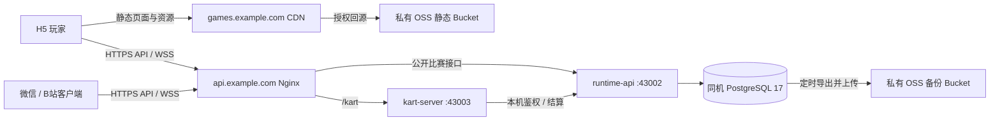

# 阿里云低成本部署方案与准备清单

核验日期：2026-09-24。目标是低流量试运营：**OSS + CDN 分发客户端，1 台 2C2G 运行服务及 PostgreSQL，好友联机限量试用，暂不买 Redis、RDS 或第二台服务器。** 本文替代原先 4C8G、静态资源与 API 同机、以后再接 CDN 的建议。

状态：已核对仓库与官方文档；本次更新部署方案，未购买资源、修改业务代码或部署生产。容量数字是待验收的运营限制，不是 2C2G 已通过的性能承诺。历史证据见 [六款游戏记录](../plans/2026-09-23-six-games-online.md)，不能替代云端验收。

## 1. 首期部署方案



Nginx、两个 Node 进程、PostgreSQL 同在一台机器。CDN 缓存静态文件；登录、比赛动作、耗时判定、排名查询与 WebSocket 直连 API 域名，不进入 CDN 缓存。H5 原单机玩法继续在客户端运行，但在线规则仍需服务端校验/模拟，后端不只是接收一个分数。

| 准备资源   | 首期规格/数量                                         | 购买与使用边界                                                                            |
| ---------- | ----------------------------------------------------- | ----------------------------------------------------------------------------------------- |
| 服务器     | **1 台，2 vCPU / 2 GiB，Linux x86_64，40–60 GiB SSD** | ECS 或符合备案条件的轻量应用服务器二选一；优先比较上海/杭州同等套餐的首购、续费和公网费用 |
| 公网       | 固定 IPv4；ECS 可先以 3 Mbps 固定带宽报价             | 仅承载 API/WSS，是否够用要实测双房快照流量；轻量按实际套餐。峰值带宽不等于持续可用带宽    |
| 静态存储   | 1 个 OSS 标准存储 Bucket                              | 存发布制品，私有读写，由 CDN 授权读取；不以 ECS 作为常态静态源站                          |
| 静态加速   | 1 个 CDN 加速域名，先按流量计费                       | 国内玩家为主先选中国内地加速；首期不叠加 ESA/DCDN，不预购大流量包                         |
| 持久数据库 | 同机 PostgreSQL 17，生产独立库                        | 不另购数据库服务器；固定受支持的安全补丁版本，不能照搬开发密码                            |
| 备份存储   | 另 1 个私有 OSS Bucket                                | 不接 CDN，与静态制品分权限；标准存储、生命周期清理，不先买归档/备份平台                   |
| 域名       | 1 个主域名，2 个子域名                                | `games.example.com` CNAME → CDN；`api.example.com` A → 服务器；均需 TLS                   |
| 暂不购买   | Redis、RDS、SLB、NAT 网关、Kubernetes、第二台 ECS     | 有负载或恢复需求再增加；备份不能省                                                        |

轻量新版套餐可能是“无固定流量”，旧套餐可能有月流量包且超出后按量计费，不能只比较“2C2G”。下单前记录带宽、流量规则、磁盘、地域、续费价和备案资格。[轻量计费项目](https://help.aliyun.com/zh/simple-application-server/product-overview/billable-items)、[ECS 公网带宽](https://help.aliyun.com/zh/ecs/public-bandwidth)。

### 架构决策及代价

| 决策                         | 原因                                                                   | 接受的代价/以后何时改变                                                             |
| ---------------------------- | ---------------------------------------------------------------------- | ----------------------------------------------------------------------------------- |
| OSS + CDN + 小服务器         | 大文件下载不挤占数据库/实时服务出网，静态访客与房间数分别扩展          | 增加缓存配置和按量费用；极低流量时未必比已有免费静态托管更便宜，但符合本期分发目标  |
| PG 持久化，不换 Redis/SQLite | 身份、事务结算、全部成绩和排名已有 PG 实现；Redis 不应作为成绩唯一存储 | 自己负责补丁、离机备份与恢复；需要托管恢复能力时迁 RDS                              |
| 一台机器，每种服务单进程     | 少组件，复用现有代码，不做集群协调                                     | 整机故障导致在线业务停机，卡丁内存房间重启中断；已缓存/下载的 H5 单机内容可继续使用 |
| 首期不运行管理服务           | 静态制品和比赛服务不需要 Creator Studio                                | 将来启用后管再按 ADR-0003 部署；Workspace Agent 仍只在开发者电脑                    |

沿用 [ADR-0006](../adr/0006-node-fastify-data-stack.md) 的 PG/Node 技术栈、[ADR-0013](../adr/0013-kart-multiplayer-service.md) 的独立卡丁模拟进程。本期只使用 [ADR-0003](../adr/0003-three-process-backend-topology.md) 的玩家运行侧，不改变管理侧的权限边界。卡丁已完成成绩经 runtime-api 持久化，实时房间仍为内存状态。

## 2. 排名、耗时与联机额度

### 数据怎么存

| 数据                                                | 首期位置及口径                                                                                                         |
| --------------------------------------------------- | ---------------------------------------------------------------------------------------------------------------------- |
| 身份、会话、昵称、比赛、有效结果、个人最佳/棋类积分 | PostgreSQL；保留全部合格玩家的排名依据，Top 100 只是显示窗口，不能删掉榜外玩家                                         |
| 比赛开始时间、截止时间、有效完成耗时                | 既有服务器时间与规则；HTTP 比赛快照在 PG，卡丁实时状态在内存、结算入 PG；不相信客户端自报用时                          |
| 页面上跳动的计时数字                                | 客户端根据服务端起止时间显示；不每秒写库，不用 Redis 保存每次变化                                                      |
| 卡丁尚未入库结果                                    | `KART_OUTBOX_DIR` 持久目录，发布不能清空，纳入备份/恢复                                                                |
| 累计游玩时长、日活、云资源消耗                      | 当前没有完整累计在线时长台账；云资源看阿里云账单。若“耗时”指累计使用时长，需另补低频会话汇总，不能把比赛计时说成已覆盖 |

**排名边界：当前六款主榜主要接受服务器验证的好友排位结果，普通单机/离线练习不会自动进入全局榜。** 限制好友联机也会限制新增合格成绩入口。首期保留此边界；若要“单人随时玩也能上榜”，需另做单人在线验证/结算，不能直接接受客户端分数。

### 试用配额：最多 4 个双人房、8 个参赛席位

这是联机额度，不是 CDN 访客上限，不限制 H5 本地单机和历史榜单读取。两个服务独立分配额度，不引入 Redis 协调。

| 范围             | 首期目标                                                           | 当前实现与上线动作                                                                                                            |
| ---------------- | ------------------------------------------------------------------ | ----------------------------------------------------------------------------------------------------------------------------- |
| 卡丁车           | 最多 2 房，2 真人/房，0 机器人                                     | `KART_MAX_ROOMS=2` 已支持；**仍需服务端限制公开服务仅排位模式**。现有休闲房最多 8 赛车并允许机器人，仅设房数不能保证 4 人上限 |
| 另外五款 HTTP PK | **五款合计最多 2 房**，2 真人/房；其中实时围捕最多 1 房            | 当前无总房数配置；需在创建/再赛共享入口原子检查额度，计入有效 waiting/playing 房间，不能只隐藏按钮                            |
| 每个玩家         | 每种服务内最多占 1 个有效房间                                      | 待补服务端校验；重复创建返回原房或拒绝，不新增占位；不做跨服务统一配额系统                                                    |
| 等待与回收       | 邀请候场最多 5 分钟，赛后空闲最多 1 分钟；正在比赛按原游戏规则截止 | 待调整。当前卡丁候场可留 30 分钟、赛后 5 分钟；HTTP 过期主要在访问时处理。须主动或分配额度时清理，不能等房主再次访问          |
| 满额/暂停试用    | 拒绝新建，保留已开始比赛/结算；榜单和本地单机仍可用                | 待补中文反馈及只控制新建的服务端开关；不排队、不高频重试，不把比赛服务总开关当“仅停好友”                                      |

卡丁配额统计进程中保留的房间，赛后/等待房释放前也占位。HTTP 要在事务内处理并发创建、rematch、过期、退出和重启后的计数；现有接口限流不能代替容量限制。清理临时房间不删除已完成成绩；有未落盘/待补交结果时先保护结果，不能为释放额度丢数据。

先不做每日次数、会员或排队系统。若 2C2G 混合负载不通过，先降到卡丁 1 房 + HTTP 1 房；仍不够再评估 2C4G，不能靠扩大 swap 宣称实时性能通过。

**原生边界：五款 Canvas 原生包当前直接进入好友 PK，没有单机练习入口；满额或断网不能承诺仍可单机玩。** H5 关闭 PK 面板可回原练习，卡丁已有独立单机。若原生也要以单机为主，需要另补对应入口/玩法，见 [原生验收记录](native-target-validation.md)。

## 3. CDN 上线前必须补齐什么

下表是本次实际查到的差距，**不是已完成的功能**。

| 项目         | 当前事实                                                                                                     | 完成标准                                                                                                                  |
| ------------ | ------------------------------------------------------------------------------------------------------------ | ------------------------------------------------------------------------------------------------------------------------- |
| 静态制品     | `pnpm build:pages` → `apps/shell-web/dist/`，相对 base；当前包含整个游戏目录，不只六款                       | 上传该目录内容并保留 `/games/<id>/` 等层级；不要只传首页/单个游戏，发布范围变更须同步目录                                 |
| API/WSS 注入 | 测试网关逐 HTML 注入同源地址，CDN 不执行此逻辑；卡丁 Web 没有可靠的生产 WSS 注入                             | 最简方案是在最终发布制品统一注入正式绝对 API/WSS 地址，只含公开配置；逐款验证 Shell/独立页，不能只设终端环境变量          |
| 构建缓存     | `turbo.json` 未完整声明比赛发布变量；卡丁预构建哈希也不含全部发布配置                                        | 若在构建期注入，补 env 透传及缓存键；若最终制品注入，则在复制缓存制品后执行并校验。改域名不能残留旧配置                   |
| 跨域         | HTTP 和 kart 各有 Origin 白名单                                                                              | 两者填页面的 `https://games.example.com`，不是只填 API 域名；验证 OPTIONS、Bearer 请求、WS Origin；原生按真实平台来源验收 |
| 联机限制     | 只有卡丁房数变量可直接使用                                                                                   | 完成第 2 节后才能宣称“4 房/8 席位受控试用”                                                                                |
| 反代后限流   | HTTP `request.ip`、WS `socket.remoteAddress` 看到本机代理；登录 20 次/分钟、WS 每 IP 16 连接可能变成全站共享 | 明确受信本机代理和真实 IP 处理，防伪造转发头；HTTP 与原始 WS 分开验收，不能简单全局开启 `trustProxy: true`                |
| 部署流水线   | 现有工作流发布 GitHub Pages，没有 OSS/CDN 生产发布流程                                                       | 配置上传、缓存刷新、证据记录与回滚步骤；不要把 Pages 自动发布当 OSS 已部署                                                |

当前 HTTP 快照轮询会锁行并更新 JSONB；实时围捕按 120Hz 补算，双人 250ms 轮询约 8 请求/秒；卡丁 60Hz 模拟、20Hz 广播。因此即使联机人数少，仍需实测 CPU、数据库与带宽。代码依据：`services/runtime-api/src/competition/store.ts`、`services/runtime-api/rules/realtime.mjs`、`services/kart-server/src/server.ts`。

### OSS、域名与缓存配置

1. CDN 源站类型选 **OSS 域名**，地址用 **Bucket 外网域名**，例如 `<bucket>.oss-cn-hangzhou.aliyuncs.com`，启用同账号私有回源授权；不使用内网 Endpoint 或省略 Bucket 前缀的地域 Endpoint，也不把备份 Bucket 授权给 CDN。CDN 可公开分发被授权 Bucket 中的内容，静态 Bucket 不得混放备份或秘密。[源站限制](https://help.aliyun.com/zh/cdn/product-overview/limits)、[私有回源授权](https://help.aliyun.com/zh/cdn/user-guide/grant-alibaba-cloud-cdn-access-permissions-on-private-oss-buckets)。
2. 防止 HTML 被当附件下载：设置正确 `Content-Type: text/html`，在 OSS 绑定 CDN 加速域名；HTTPS 回源时，在 OSS 为绑定的 `games.example.com` 托管证书，CDN 回源 Host 与 SNI 均使用该域名。DNS CNAME 仍指向 CDN，不改成直连 OSS。验证浏览器实际打开 HTML 而非下载文件。[HTML 下载排查](https://help.aliyun.com/zh/cdn/requests-sent-to-cdn-accelerated-domain-names-to-access-html-files-trigger-automatic-downloads-of-the-files/)、[自定义域名回源](https://help.aliyun.com/zh/oss/how-does-cdn-use-an-accelerated-domain-name-to-return-to-the-source-oss)。
3. 私有回源不能依赖匿名静态网站默认首页。先确保 `/index.html` 可用，再配置并测试 `/` → `/index.html`、`/games/<id>/` → 对应 `index.html` 的 CDN URL 重写；无尾斜杠目录先规范化。保留邀请 query，不能把所有未知 JS/图片都回退成首页。[私有源首页冲突](https://help.aliyun.com/zh/oss/user-guide/cdn-acceleration)。
4. 配 TLS、HTTPS 跳转、JS/WASM/字体/音频 MIME，验证压缩响应。Shell 与游戏保持同一静态 origin，保留 iframe 全屏许可及 `Permissions-Policy: fullscreen=(self)`，不加 `X-Frame-Options: DENY`。

| 内容                                                                 | 首期缓存建议                                                     |
| -------------------------------------------------------------------- | ---------------------------------------------------------------- |
| HTML、发布配置、`build-info.json`                                    | `Cache-Control: no-cache`，CDN TTL 0，低流量阶段优先确保配置可见 |
| 内容哈希文件名/不可变版本路径                                        | `public, max-age=31536000, immutable`；同 URL 永不覆盖不同内容   |
| `competition.js`、`competition-session.js` 等无版本 JS/CSS/JSON/素材 | 先用 300 秒；发布刷新覆盖的同名 URL，要长缓存先版本化            |
| API、身份、房间、个人榜单                                            | API 域名直连，保留 `no-store`，不缓存含个人数据的响应            |
| 403/404/5xx                                                          | 不做长缓存，避免首发缺文件/错误权限长期残留                      |

不要对全部 `.js` 套一年缓存，也不要用高权重 `/` 规则误禁全站缓存。实际检查响应头和命中情况。[CDN 缓存规则](https://help.aliyun.com/zh/cdn/user-guide/configure-the-cdn-cache-expiration-time)。

优先将完整站点放在不可变版本目录并切换入口，或使用经过验证的先资源、后入口更新步骤；保留上一套完整制品及旧哈希资源。同名文件须有刷新和回滚清单，不能在旧页面还引用资源时全量“同步删除”。

H5 的页面/资源走 CDN；微信/B站主包仍通过平台审核和分发，现有原生包主要使用本地包/分包。只有实际引入远程资源时再配 CDN 下载域名并专项验收，上传 H5 不能替代原生发布。

## 4. 2C2G 运行配置与备份

- 构建放本机/CI：Node **≥24.12**、锁定 pnpm **8.14.1**，Cocos 使用既有 Creator 环境。云机不跑 Cocos、浏览器测试、Turbo 全仓构建、开发 watch。
- systemd 管理 Nginx、runtime-api、kart-server 和 PG，业务各 1 进程，不开 cluster；不部署 Management、Studio、Workspace Agent、MinIO。开发 Compose 含固定密码，不能整套复制上线。
- PG 调优起点可评估 `shared_buffers=128MB`、`work_mem=4MB`、`max_connections=20`；现有 runtime 池上限 5。这些不是已应用值；监控总 RSS，不把 Node heap 上限当总内存上限。
- 持续保留至少 20% 可用内存、30% 磁盘余量；日志轮转并限总量。数据库、日志、备份暂存与 outbox 都计入磁盘预算。
- 公网仅 443；80 用于 HTTPS 跳转/证书验证；22 仅管理员 IP。5432、43002、43003 不对公网；服务监听本机。
- Nginx 仅放行现有公开比赛路由与 `/kart`，默认拒绝其余路径，显式拒绝 `/api/competition/v1/internal/`、管理和工作区路径；支持 WS Upgrade，合理设置空闲超时，不缓存 API，不记录 token/Secret。可复用测试网关路由白名单，但不能直接转发整个 runtime。

### 服务配置台账

真实 Secret 仅放服务器受限环境文件/Secret Store。下列域名都是占位，地址配置仍需通过第 3 节产物检查。

| 作用域         | 字段与目标值                                                                                                                                                              |
| -------------- | ------------------------------------------------------------------------------------------------------------------------------------------------------------------------- |
| runtime-api    | `RUNTIME_DATABASE_URL` → 生产 runtime 角色；`COMPETITION_ENABLED=true`；`PORT=43002`；`COMPETITION_ORIGINS=https://games.example.com`                                     |
| kart-server    | `HOST=127.0.0.1`；`KART_SERVER_PORT=43003`；`KART_MAX_ROOMS=2`；`KART_ALLOWED_ORIGINS=https://games.example.com`                                                          |
| 内部结算       | 两服务相同随机 `COMPETITION_INTERNAL_KEY`（至少 32 字符）；kart 的 `COMPETITION_API_URL=http://127.0.0.1:43002/api/competition/v1`，不填公网 URL                          |
| kart 持久目录  | `KART_OUTBOX_DIR=/var/lib/small-games/kart-results`，业务用户可写，不随发布目录替换                                                                                       |
| 客户端公开配置 | API `https://api.example.com/api/competition/v1`；WSS `wss://api.example.com/kart`。已有构建入口 `COMPETITION_PUBLIC_API_URL`、`KART_SERVER_URL` 不能代替最终静态注入检查 |
| 原生登录       | 服务端 `COMPETITION_PLATFORM_CONFIG` 保存 platform/AppID/secret；客户端仅 AppID 和公开地址                                                                                |

不存在的 HTTP 房数变量不能填进 `.env` 假装生效。`COMPETITION_PORT` 用于开发编排/网关，直接运行 runtime 读取的是 `PORT`。

初期恢复目标建议 **RPO ≤24 小时、RTO 目标 4 小时**，须演练确认；表示最坏可能丢一天新纪录。如果不能接受，提升备份频率、采用 WAL 恢复或 RDS。每日 PG 完整备份上传私有备份 Bucket，保留最近 7 个日备份与 4 个周备份，备份失败报警，每月至少新库恢复一次；规则/制品版本和 outbox 一并保存。OSS 离机副本覆盖整机故障，但同账号备份仍依赖权限保护，不能称为跨地域/跨账号灾备。

## 5. 费用核算与止损

月成本 = **服务器/续费月摊 + API 公网费 + CDN 下行 + HTTPS 超额请求 + OSS 存储/请求/回源流出 + 备份/快照 + 域名/证书月摊**。套餐已含的盘/带宽不重复算；CDN 侧不收回源流量费，不代表 OSS 向 CDN 流出免费。[OSS + CDN 计费关系](https://help.aliyun.com/zh/cdn/product-overview/billing-of-oss-content-acceleration)。

量级示例：官方选购文档使用中国内地按量约 **0.24 元/GB** 计算，20 GB ≈ 4.8 元、100 GB ≈ 24 元、500 GB ≈ 120 元，**仅 CDN 下行这一项，不是整套月价**，成交价格以控制台为准。首期不囤用不完的流量包。[官方费用示例](https://help.aliyun.com/zh/cdn/product-overview/guidelines-for-choosing-resource-plans)。

当前官方说明静态 HTTPS 每月前 500 万次免费，超额 0.05 元/万次，实际计费以购买页为准；首期无需先买请求包，下行包也不抵扣此项。[HTTPS 计费](https://help.aliyun.com/zh/cdn/product-overview/billing-of-https-requests-for-static-content)。

流量按真实下载估算：假设每天 100 次未命中浏览器缓存的访问，每次新增下载 20 MB，30 天约 60 GB（十进制粗估）；不同游戏冷启动、重复访问、版本更新、预热另算。CDN 命中减少的是源站压力，玩家从 CDN 下载仍计出网。上线前测各游戏冷/热启动和 10 分钟 WSS 流量，再修正预算。

| 必填预算记录                                | 用户填写 |
| ------------------------------------------- | -------- |
| 服务器首购价/期限、续费价/期限、折合月价    | 待报价   |
| 包含磁盘、公网计费类型、流量/带宽及超额规则 | 待报价   |
| CDN GB/月、HTTPS 请求/月，若买包则有效期    | 待测量   |
| OSS 静态/备份 GB、回源 GB、请求量、保留天数 | 待测量   |
| 域名/证书/快照等附加费、正常月预算 B        | 待填写   |
| 可接受异常费用风险、告警联系人、停服处理人  | 待填写   |

- 总费用设置预算提醒，例如 B 的 50%/80%/100%，另设日用量异常提醒；提醒不是硬停机。
- CDN 配流量/带宽/HTTPS 请求数用量封顶，按预算和实测量倒推阈值，记录解封策略并验证通知；封顶会让静态站点不可访问。
- **官方注明监控约有 10 分钟延迟，期间仍计费；资源包用尽会继续按量。** 封顶不能保证精确人民币最高账单，也不能靠账户只留少量余额防超支。[用量封顶](https://help.aliyun.com/zh/cdn/user-guide/configure-usage-cap)。
- 源站保持私有，Referer 防盗链须覆盖正常分享、空 Referer、微信/B站请求，防止误封。异常时先停新增联机；静态遭刷在 CDN 侧处置，不自动回退 ECS 下载。

## 6. 可直接勾选的准备清单

负责人：**用户**负责账号/购买/主体资料，**实施者**负责配置和验收。台账仅存非敏感标识、配置引用与证据，不在 Git/聊天放完整 Secret。

### A. 购买前

- [ ] 用户：确定首批渠道/游戏，可以先 H5；原生按本批目标准备，不为未来 12 个应用提前购买基础设施。
- [ ] 用户：阿里云实名账号、MFA、受限 RAM 运维身份、费用告警联系人。
- [ ] 用户：主域名、实名、续费提醒；预留 `games` 和 `api`。
- [ ] 用户：完成地域与 ECS/轻量二选一报价，填写第 5 节预算，核对首购资格、续费、磁盘和公网。
- [ ] 用户：核对中国内地 CDN/服务器所需 ICP 备案、源站接入备案、主体证照/负责人资料，以及实例备案资格。
- [ ] 用户：按主体、业务和地域在官方入口核对适用的网站/公安联网备案及小游戏资质/应用备案/审核；域名实名、网站备案、平台审核互不替代。

加速范围含中国内地时域名需要 ICP 备案；CDN 本身不强制接入备案到阿里云，阿里云大陆 API 源站另核对接入要求。[CDN 备案规则](https://help.aliyun.com/zh/icp-filing/basic-icp-service/product-overview/use-alibaba-cloud-cdn)。当前官方备案准备页要求适用 ECS/轻量包年包月、购买时长**大于 3 个月**（含累计续费），ECS 还需公网带宽；具体套餐/账号以备案控制台核验，不能买一个月后才发现无法备案。OSS/CDN 不能替代备案接入资源。[备案前准备](https://help.aliyun.com/zh/icp-filing/basic-icp-service/user-guide/overview)。

### B. 开通与配置

- [ ] 实施者：创建 1 台服务器、业务用户及持久数据目录；记录实例 ID、地域、公网 IP、SSH 密钥引用，设置补丁/重启维护窗口。
- [ ] 实施者：两个私有 OSS Bucket；CDN 只读静态 Bucket，发布账号限定写入范围，备份权限与发布凭据分离。
- [ ] 实施者：CDN/DNS、客户端到 CDN、CDN 回源和 API 的 TLS/续期，私有回源、HTML 在线展示、根/子目录与缓存验证。
- [ ] 实施者：安全组/防火墙只开必要入口，公网无法访问 DB、业务端口、internal、管理和工作区路径。
- [ ] 实施者：生产 PG17 独立库/凭据；owner 仅迁移，runtime_app 仅 runtime schema，不导入开发玩家/测试成绩。
- [ ] 实施者：依据 `001-local-ownership.sql` 初始化角色和 schema_version，替换所有开发密码；随后 owner 执行 `010-competition.sql`、`011-competition-profiles.sql`，验证运行角色无管理 schema 权限。
- [ ] 实施者：配置第 4 节两个服务和 Secret，outbox 放持久目录，systemd 自启/异常重启及日志轮转。
- [ ] 实施者：费用/CPU/内存/磁盘/5xx/备份失败告警，实际触发一次通知确认到人；CDN 封顶及解封处置记录。
- [ ] 用户/实施者：确认 RPO/RTO 和可接受停机范围，每日离机备份、保留期、恢复负责人及演练安排。

### C. 代码、制品与云端验收

- [ ] 实施者：补第 2、3 节限额/模式/过期/满额反馈/只停新建功能，覆盖并发创建、再赛、退出与重启，不超卖席位。
- [ ] 实施者：完成最终六款静态 API/WSS 注入；检查实际使用的配置无 localhost/测试隧道/测试 AppID，制品无 Secret，改地址后不会复用旧配置。
- [ ] 实施者：固定根/子模块 commit，在本机/CI 构建并记录文件校验值。后端保留 rules、其引用的游戏源码及历史场景 JSON/图片、象棋子模块、kart TS 源码和 workspace 依赖；最简可部署固定版本完整工作区及所需制品，不能只复制 runtime/dist。
- [ ] 实施者：上传完整站点，验证首页、六款独立页、Shell iframe、图片/字体/音频、邀请参数、刷新/返回；H5 API 断开后关闭 PK 可继续练习，在线入口真实报错。
- [ ] 实施者：独立预发库执行既有规则/集成测试和新增限额检查；`competition.integration.mjs` 写入测试数据，只允许隔离 `competition_test`，不可指向生产。
- [ ] 实施者：公网两份独立身份完成登录→邀请→比赛→权威结算→榜单，覆盖 Top100/榜外名次、重复提交、断线、服务重启、outbox 补交、跨域预检及个人响应不缓存。
- [ ] 实施者：真实 2C2G 持续至少 30 分钟混合负载：2 个卡丁双人房 + 2 个 HTTP 双人房（含实时围捕）+ 榜单读取；额外创建被拒绝。记录 CPU/RSS/可用内存、磁盘、API p95、错误率、tick 延迟、WSS 出网，不能用旧的 102 人串行 SQL 测量代替。
- [ ] 实施者：CDN 冷/热加载、手机浏览器真全屏进退/旋转/触点/弹层/进度；静态下载与 ECS 负载分开验证。
- [ ] 实施者：离机备份→新库恢复，核对身份/结果/个人最佳/榜外排名与 outbox；恢复时间达到目标，验证上一静态/服务制品回滚。
- [ ] 用户/实施者：记录通过/未通过范围，确定发布窗口；保留既有未通过质量/平台边界，不能把本清单勾选等同于六款全面验收通过。

### D. 原生平台，按本批上线范围准备

- [ ] 用户：每款每平台独立 AppID、主体/审核资料、开发者/体验成员；六款两平台全上才是 12 个目标。
- [ ] 用户/实施者：AppSecret 安全注入服务端，配置 request/Socket 合法域名；以后实际用远程资源再配下载域名。
- [ ] 实施者：五款 Canvas 用 `platforms/competition/release-config.example.json` 的忽略副本；卡丁用其 `release-config.local.json`；改正式地址后重新构建。
- [ ] 实施者：逐目标开发工具、体验版、实体两手机验证真实登录/分享拉起/PK/结算/排名，明确满额行为。关闭域名校验、网页链接或 H5 CDN 验收不能替代平台通过。

逐目标状态见 [原生验收](native-target-validation.md)。本次未进入用户平台后台，账号资格/审核均未核验；实际发布按 [B站登录](https://miniapp.bilibili.com/small-game-doc/open/login)、[服务域名](https://miniapp.bilibili.com/small-game-doc/guide/urlwhitelist)、[微信登录](https://developers.weixin.qq.com/minigame/dev/api/open-api/login/wx.login.html) 等官方后台要求逐项确认。

## 7. 实施顺序、命令和扩容条件

顺序：**主体/预算 → 备案资格与采购 → 静态注入/限额改造 → 本机/CI 构建 → 预发配置/恢复演练 → 云端混合验收 → 按渠道发布。** 备案等待期间可先做代码和隔离测试。

现有入口如下，不是一键生产部署脚本；生产还需第 3 节修正及发布配置。联调详细步骤见 [本地联调手册](six-games-local-integration.md)。

```powershell
# 开发机/CI 的仓库根目录，不在 2C2G 生产机全仓构建
pnpm install --frozen-lockfile
pnpm check:games
pnpm --filter @coffeeeeffoc/runtime-api... build
pnpm --filter @coffeeeeffoc/runtime-api test
pnpm --filter @coffeeeeffoc/kart-server typecheck
pnpm --filter @coffeeeeffoc/kart-server test
pnpm build:pages
pnpm test:pages
# 另按联调手册启动隔离服务后再执行
node scripts/competition.integration.mjs
# CDN 真实发布后可复用页面烟测，不能替代业务/手机验收
$env:PAGES_URL = 'https://games.example.com/'
pnpm test:pages
```

systemd 分别运行 `pnpm --filter @coffeeeeffoc/runtime-api start`、`pnpm --filter @coffeeeeffoc/kart-server start`：前者执行 `dist/main.js`，后者由 Node24 直接执行 `src/main.ts`。明确 systemd 的绝对可执行路径、工作目录、依赖和受限环境文件。

备份命令沿用 `pg_dump --dbname=service=game_backup -Fc -f <备份文件>`；恢复到**新库**用 `pg_restore --exit-on-error --dbname=service=game_restore <备份文件>`，连接由受限 `PGSERVICEFILE`/凭据文件提供，导出后上传 OSS 并验证。`pg_dump` 不含集群角色：整机重建时先按生产初始化记录创建 owner/业务角色、权限和新的安全凭据，再向空库还原；角色初始化步骤与受限连接配置也纳入恢复材料。先核验恢复结果再切库；应用回滚保留兼容数据库迁移，不做破坏性降级。发布前停新房，等在途比赛结束或明确通知中断，卡丁实时房不能跨进程保活。

| 观测信号（首期告警起点）                                | 先做什么                                        | 再考虑什么                                         |
| ------------------------------------------------------- | ----------------------------------------------- | -------------------------------------------------- |
| CPU >70% 持续 10 分钟、tick 经常超出当前步长预算        | 停新联机、定位规则热点、降房额                  | CPU 不足再升规格或拆 kart；仅加内存不解决 CPU 饱和 |
| 可用内存 <20%、OOM 或持续 swap                          | 查进程/日志/连接池，降低并发                    | 优先 2C4G，暂不增加分布式服务                      |
| 应用侧 HTTP p95 >200ms、非主动限流 5xx >1% 持续 10 分钟 | 查 PG 慢查询/锁、池排队和事件循环，公网延迟另记 | 查询优化后再决定缓存，实测需要才加 Redis           |
| 数据库盘 >70%、备份/恢复不达目标                        | 清日志/过期备份，保留全部排名依据               | 扩盘或迁同地域 RDS                                 |
| API 公网长期接近带宽上限                                | 测每房 WS 字节、排查静态绕回 ECS                | 加带宽；CDN 访问上涨本身不要求加业务服务器         |
| 好友额度持续满且确有需求                                | 看拒绝次数与活跃情况，重新压测                  | 逐步提房额，之后才考虑多实例路由/共享缓存          |

本地 PG/浏览器/隧道通过项、阿里云容量、CDN 正式链路、原生工具和实体设备验收分别记录；只有对应证据齐全，才勾选相应上线项。
