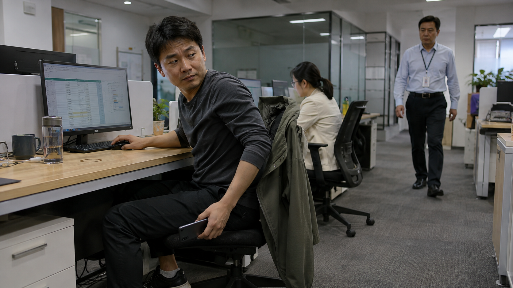

# 《打工人摸鱼记》写实交互与场景关卡设计 v1

> **已被替代（2026-09-12）**：用户已明确要求删除固定镜头玩法，改为可移动、可环顾的第一人称场景与完整一周的时间编排。当前设计以 [第一人称与一周场景设计](2026-09-12-game-office-first-person-design.md) 为准；本文仅保留场景灵感与历史依据，其中固定镜头、竖屏、首做工位样板和 24 关章节路线均不再作为实施要求。

日期：2026-09-07。范围：`apps/game-office` 的玩法、美术、人物表演、声音与制作顺序。

用户已选择：**固定镜头写实，真实比例人物、细腻动作表情，兼顾 B 站小游戏与手机表现。** 下文是可进入样板制作的设计提案；关卡数值、资产预算和验收目标均待实机验证，不代表已实现或已达到 AAA 水准。

## 1. 游戏要让人体验什么

玩家扮演一名普通打工人，在真实的办公室秩序里找回一点属于自己的时间：完成够用的工作，察言观色，寻找空当，享受偷来的片刻放松，再自然地回到工作状态。

核心情绪循环是：**发现机会 → 偷到一点快乐 → 想多待一会 → 察觉危险 → 合理收手 → 侥幸过关后松一口气。** 每局要有真正轻松的间隙，紧张才有对比。幽默来自熟悉的处境、眼神和小动作，例如文件名“最终版\_再改一下”、已经空了还捧着的杯子、会议最后一分钟的“我再补充两点”。

写实分四项验收：

| 维度       | 必须达到的表现                                                                         |
| ---------- | -------------------------------------------------------------------------------------- |
| 人和空间   | 正常人体比例、可信办公室尺度、衣料与皮肤质感、统一光照、正确遮挡和接触阴影             |
| 动作和表情 | 角色有观察、重心、抓握、惯性和收尾；眼神有目标，紧张与放松能从身体上读出来             |
| 社会反应   | 老板有自己的任务和注意力，同事有善意、忙碌和边界；正常喝水、上厕所、合法休息本身不扣分 |
| 声音和因果 | 脚步来自走路，椅轮声来自移动；玩家说得清是谁、从哪里、看见或听见了什么                 |

画面目标可以对照高品质写实游戏，但 AAA 级全身表演、近景面部、任意镜头与大量独有动作属于更大制作量。此路线把质量集中在选定镜头内的脸、手、坐姿、接触物和光照，逐关用实际交互证明效果。

## 2. 现有版本与改造起点

本次已检查当前源码：

- `src/domain/model.ts`：以一秒为单位增减快乐与疑心，风险主要来自 `slacking` 和 `bossWatching` 两个布尔值。
- `src/domain/state.ts`：五日流程、失败、结算、防窥屏升级与可选奖励恢复；目前每日结束按时间推进，`target` 没有成为独立通关条件。
- `src/content/schema.ts`：内容固定为五天，只有名称、任务、检查概率、颜色、目标和时长。
- `src/view/OfficeGame.tsx`：文字、简单工位与 emoji，主要操作是按住/松开。
- `src/canvas.ts`：B 站路径使用通用文字/按钮画布，每秒随机抽取老板检查结果。

以上路径相对于 `apps/game-office`。这些能力适合保留存档与平台接入基础，但场景互动、连续动作、空间观察和声音需要实际新增。不能只换背景、加几张人物图，就宣称已实现本设计。

## 3. 画面与制作路线

| 方案                         | 得到什么                                                                       | 主要代价                                                           | 本次选择                             |
| ---------------------------- | ------------------------------------------------------------------------------ | ------------------------------------------------------------------ | ------------------------------------ |
| 固定镜头写实、预渲染分层播放 | 统一三维角色制作后，把指定视角的身体动作、表情和场景分层输出；集中打磨可见区域 | 图集占用、动作过渡、遮挡层与接触阴影需要精确管理；不能自由旋转镜头 | **采用，先做一个场景验证**           |
| 实时三维                     | 可以改变镜头，连续处理空间、光照和姿态                                         | 需要重新验证渲染接入、绑定、设备性能和制品体积                     | 当固定视角资产无法满足必要互动时评估 |
| 真人拍摄分支                 | 真实的脸、材质与表演                                                           | 演员、拍摄与剪辑成本；动作打断、道具连续性和分支组合困难           | 暂不采用                             |

**制作角色用三维，手机播放可以用二维分层。** 推荐以 Blender 的角色绑定、动作和表情形变能力制作一致的人物，再输出固定视角资源；这些制作能力有官方说明。[Blender Animation & Rigging](https://www.blender.org/features/animation/)

这条路线仍需验证动画图集的解码内存、加载和跳转质量。先做“拿手机中途收手”的可交互测试，再决定具体导出帧率、图集格式与尺寸。不能把整关导出为不可打断视频，也不能把两个差异很大的姿势透明叠加当作自然过渡。

手机倾角与滑椅先限定在少量经过编排的姿态区间和移动路径内，连续播放匹配动作并保留输入控制。滑椅不能只平移坐姿贴图，让脚在地面滑行；必须验证脚蹬地、位移、刹停与接触的完整关系。

### 镜头与屏幕布局

- 先沿用当前 B 站竖屏方向，以 390 × 844 为构图参考，采用等比缩放和安全留边。前景给主角脸/手与操作对象，上方纵深给主要来路，不能各自拉伸宽高。概念横幅只说明人物、材质与气氛，不是最终手机构图。
- 桌面场景略高于坐姿眼线，保留表情可读性；走廊使用更宽的固定镜头；线上会议使用电脑界面与人物同框。
- 可以有少量固定机位切换，但切镜前后危险时间不偷偷推进；操作中的镜头保持稳定。远景看不清表情时，靠头、肩、手势传达，不反复强制切脸部特写。
- 主画面优先给场景。HUD 只显示本关目标、剩余时间、当前风险；证据与危险主要通过场景传达。新手可开启方向提示、风险说明和人物字幕。
- 点击屏幕/手机/杯子等实际物体触发行动；可操作区域有短暂轮廓反馈。长按、点击、拖动均有明确起点和结束反馈。
- 拇指不得覆盖关键手部动作或老板来路。提供左右手操作布局；拖动有点击目的地替代，长按有切换模式替代，键盘提供等效输入。

## 4. 核心规则：玩家在判断什么

### 一局的目标

普通关建议 60–120 秒，教学关 45–60 秒，组合关 120–180 秒，均为待试玩的初始目标。每关最多两个主要任务：完成合理的工作/返回要求，并获得足够的个人快乐。工作动作简短而有语义，例如确认一项数据、记下一个会议重点，不把游戏变成另一份重复劳动。

基本通关要求：完成场景明确的必要任务、达到本关快乐目标、未被明确识破。打卡等导入关另有专属目标，不强塞刷手机积分。三星分别对应基本完成、合理收尾与附加挑战；失败后可立即免费重试本关，不强制从周一重来。纯放松教学段不设失败惩罚。

### 观察、伪装与证据

老板行为依次为日常活动、注意到异常、核实、确认或离开。老板先有目的地和活动，再产生朝向与视线；禁止每秒随机切换“看见/没看见”。同事也会取水、打印、讲笑话、结束聊天，不是永远站在原地的道具。

发现由实际条件决定：

1. 对方是否有感知机会：位置、朝向、遮挡、距离与可听见的声响。
2. 当时是否存在证据：手机可见、非工作窗口在共享范围、笑声、无人照看的物品、答非所问。
3. 证据是否足够明确、持续多久：先怀疑，必要时靠近或提问，再确认；普通短暂一瞥不直接判失败。

“装忙”只消除它确实处理的证据。切回表格不能收走手里的手机；把手机收好不能关掉开着的麦克风；捧杯子不能解释没有水还不断按接水键。此前怀疑需要合理时间和后续表现回落。

所有关卡至少提供视觉预警；声音用于增强。首次教学预警应足够玩家完成一次正常收尾。初始调参要求：**可见预警到首次有效检查的时间 ≥ 当前动作最大合法收尾时间 + 反应余量**。样板暂按至少 0.8 秒反应余量调试，须用目标手机与新玩家验证。后期增加同时要处理的线索，不能直接把窗口缩到不可反应。

随机只选择有前兆且可解的变体。不能生成门外来人和必须立刻答话、又无法收手机的必输组合。失败给一个简短的现场解释，如“老板从右侧通道看到仍亮着的手机”，并允许跳过回放直接重试。

### 操作语法

| 操作类型          | 用在哪里                       | 技能成长                         |
| ----------------- | ------------------------------ | -------------------------------- |
| 点击/按住后收尾   | 手机、看视频、短暂闭目         | 判断什么时候开始、什么时候提前停 |
| 拖动物体与短路线  | 手机入抽屉、挪椅子、偷偷打卡   | 路线、遮挡、速度、停靠与证据清理 |
| 控制声音/动作幅度 | 厕所门外来人、茶水间聊天、椅轮 | 使用环境节奏，保持合理停留       |
| 听看信息后接话    | PPT、同事请教、老板追问        | 分配注意力，记住关键点再伪装     |
| 管理界面状态      | 线上会议、窗口切换、投屏       | 识别共享范围、摄像头与麦克风状态 |

## 5. 24 个关卡：六章逐步增加能力

下面每关需要有专属操作与至少两种可读变体。章节是上班日常的叙事顺序；**制作顺序先做第 05 关样板**，不按表格从头批量铺素材。

### 第一章：早高峰，先坐下来

| ID / 关卡               | 目标与独有操作                                                     | 可见预警、暴露与补救                                                       | 场景/动作/声音重点                             | 复玩变化                                     |
| ----------------------- | ------------------------------------------------------------------ | -------------------------------------------------------------------------- | ---------------------------------------------- | -------------------------------------------- |
| 01 迟到的最后一分钟     | 在规定时间内抵达工位；短拖路线借队伍遮挡，工牌对准读卡区并选择时机 | 老板朝向和签收动作提前显示窗口；探身被看到触发询问，停步自然回应后仍可继续 | 湿外套、歪工牌、放慢的步幅、电梯提示和刷卡“滴” | 老板签快递、接电话或等电梯；队伍移动不同     |
| 02 电梯门开了，老板也在 | 选择站位、出入顺序，不抢在移动遮挡消失时走出去                     | 楼层/开门提示和人物转身预告路线；硬挤碰人引注意，可停下来扶门              | 逼仄空间、鞋尖挪动、包与门接触、沉闷开门声     | 搬水车、文件箱或熟悉同事改变可走路径         |
| 03 人到工位，魂还没到   | 放好包/外套/杯，恢复工作现场后取得第一段小休息                     | 开场可见上次工位状态；背着包空敲键盘会被问，补做真实准备可继续             | 待机光、旧便签、落座、脱外套、椅子承重         | 桌面物品和昨天工作窗口不同，形成短物品安排题 |
| 04 第一杯咖啡续命       | 控制接杯/停止，在机器工作间隙回复一条消息并及时让位                | 液位、泵声、排队者动作可见；溢杯或占着不取引催促，可擦台面补救             | 蒸汽、杯壁水珠、手扶杯柄、磨豆/泵水/杯底声     | 不同程序和排队人数，改变空闲窗口             |

### 第二章：工位上的小自由

| ID / 关卡                       | 目标与独有操作                                                            | 可见预警、暴露与补救                                                            | 场景/动作/声音重点                                       | 复玩变化                                           |
| ------------------------------- | ------------------------------------------------------------------------- | ------------------------------------------------------------------------------- | -------------------------------------------------------- | -------------------------------------------------- |
| 05 工位偷闲：Excel 后面的一小局 | 完成一次数据确认并积累快乐；切换工作/娱乐窗口，手机拿放与窗口清理分开处理 | 老板合文件、起身、脚步及来路都可见；非工作窗口/手中手机分别留下证据，收好再回应 | 侧目、忍笑、收手机、手回鼠标、老板停步；这是完整制作样板 | 来人站位、路线、同事递文件和手机振动，先逐项再组合 |
| 06 桌沿下面再刷一条             | 控制手机倾角与坐姿，在看清内容、颈部舒适和遮挡之间选择                    | 邻座起身与椅背抬高预告新视角；越过桌沿的手机可见，可先扣屏再收纳                | 手肘支撑、袖口、颈部前倾、手机轻碰桌沿                   | 侧边过道、桌面反光和隔板高度不同；反光只作补充线索 |
| 07 耳机里根本不是培训           | 在模拟培训与娱乐音轨间切换，及时摘一侧耳机回应                            | 叫名前的靠近、人物转向和字幕都可见；忽略连续呼唤才追问                          | 摘戴耳机、目光回转、节目暂停后环境变清晰                 | 单耳/头戴耳机的动作耗时不同，节目笑点提前显露      |
| 08 小群里的最后一张表情包       | 用有限短句接梗；发送前识别虚构聊天对象和窗口                              | 群名、头像、聊天内容持续显示；发错工作群进入短圆场，未发草稿可改                | 指尖悬停、邻座憋笑、清嗓子、克制消息提示                 | 不同话题与切换次序；接得自然比快速乱点分高         |

### 第三章：离开工位的艺术

| ID / 关卡               | 目标与独有操作                                                | 可见预警、暴露与补救                                                       | 场景/动作/声音重点                         | 复玩变化                                   |
| ----------------------- | ------------------------------------------------------------- | -------------------------------------------------------------------------- | ------------------------------------------ | ------------------------------------------ |
| 09 厕所隔间的私人宇宙   | 在已知返回时间前享受短视频；先锁门/处理音量，再安排收纳和离开 | 门影、排队字幕、把手和通知先变化；外放或错过约定才带来后果，暂停收好再回应 | 封闭门板、门锁、狭小坐姿、排风和瓷砖混响   | 风机周期、来电振动位置和门外排队改变安排   |
| 10 洗手台边最后一句     | 读完消息、收手机、洗手、擦干，管理动作顺序                    | 镜面来人与门口提示可读；湿手强行操作延误返回，先收进干燥位置可避免         | 水痕、感应水流、湿袖口、烘手机、实际擦手   | 纸巾/烘手机和水池位置不同；洗手本身不扣分  |
| 11 同事工位旁的八卦交换 | 把闲聊话题自然接到真实工作上下文，并选好结束时机              | 同事看过道、手回键盘是暗号；仍背对屏幕大笑才引注意                         | 半转椅、低声笑、同事手势、键盘突然停下     | 同事忙碌程度、当前文档和话题组合不同       |
| 12 坐着挪椅子的请教术   | 短推椅子、控制惯性、到位刹车，指向预先准备的文档              | 路线、地缝和人物让路可读；撞桌或滑过头引注意，停稳后可转正常请教           | 脚蹬地、躯干平衡、手扶桌、椅轮从地毯到硬地 | 路线、阻力区和座位改变；可争取一次平稳到位 |

### 第四章：会议室生存指南

| ID / 关卡              | 目标与独有操作                                           | 可见预警、暴露与补救                                                                  | 场景/动作/声音重点                                 | 复玩变化                                                 |
| ---------------------- | -------------------------------------------------------- | ------------------------------------------------------------------------------------- | -------------------------------------------------- | -------------------------------------------------------- |
| 13 会前还有五分钟      | 选座位、备好材料，会前自由休息；会议开始后及时收尾       | 会前看手机不增加风险；主持人宣布开始并留收尾窗口后，继续娱乐或妨碍入座才进入提醒/核实 | 桌面指纹、线缆、拉椅声、投影启动、随入座变化的视线 | 桌形、投影位置、入座顺序不同                             |
| 14 老板 PPT 的第 38 页 | 桌边短操作与听讲交替，把关键词落到笔记，必要时指对图表   | 遥控笔抬起、停顿、讲者转身先预告重点；遗漏后允许一次确认问题                          | 桌下手腕、笔尖、困倦眼睑、翻页、投影风扇与讲话停顿 | 不同但完整提供的讲稿、提问点和自由段落                   |
| 15 线上会议悄悄切 App  | 在游戏内桌面管理前台应用、共享范围、麦克风和摄像头       | 共享边框、状态文字/图标、波形、发言请求都可见；娱乐进入共享或外放入麦分别判定         | 鼠标目标、人物脸部、耳机、虚构会议提示             | 单窗口共享、轮流展示、提前通知的演示请求；不读取真实桌面 |
| 16 突然喊了你的名字    | 根据刚提供的信息组合主题、结论和回应；可请求一次自然确认 | 主持人看向玩家、提问前半句和字幕给反应期；明显答非所问才升级追问                      | 吞咽、坐直、找页码、同事递眼色、短暂安静           | 议题、提问方式和一次有限的同事提示不同                   |

### 第五章：下午两点，人需要恢复

| ID / 关卡             | 目标与独有操作                                             | 可见预警、暴露与补救                                                   | 场景/动作/声音重点                             | 复玩变化                                               |
| --------------------- | ---------------------------------------------------------- | ---------------------------------------------------------------------- | ---------------------------------------------- | ------------------------------------------------------ |
| 17 健身房的超长拉伸   | 在公司健身活动中调坐姿与伸展衔接，争取舒适恢复且跟上活动   | 教练倒数、镜中队伍换姿势先预告；大家起身自己还摊着会被提醒，可自然接上 | 垫子压痕、呼吸、衣料、重心、器械静止时休息     | 课程顺序、伙伴节奏和休息段不同；不做危险器械操作挑战   |
| 18 茶水间的第二场会议 | 给多位同事接话，添水/递杯穿插闲聊，让谈话自然持续          | 谁转身、谁让路、老板是否加入都明示；脱离话题或空杯装接水才引注意       | 杯壁水珠、茶包线、勺碰杯、让位与手势           | 不同同事组合触发后续短故事；用有限分支，无复杂关系数值 |
| 19 微波炉前的两分钟   | 安排饭盒队列，在等餐空当完成短游戏，及时取餐并让位         | 炉灯、剩余时间和排队者明示；长时间占用引催促，暂停娱乐让位可恢复       | 蒸汽、饭盒盖、取餐手势、马达与结束提示         | 加热时间、排队需求与插入请求不同，形成小排程题         |
| 20 休息沙发闭眼一会儿 | 在正常休息时段设置闹钟、选支撑姿态，按时回去；本关着重恢复 | 约定时间和闹钟先提醒；更深放松需要更长起身，不凭空抓人                 | 沙发塌陷、肩膀下沉、平稳呼吸、振动与柔和环境声 | 靠垫、可用时长和来人目的不同；提供一关低压力节奏       |

### 第六章：把一天过成自己的

| ID / 关卡                 | 目标与独有操作                                       | 可见预警、暴露与补救                                                   | 场景/动作/声音重点                         | 复玩变化                                                       |
| ------------------------- | ---------------------------------------------------- | ---------------------------------------------------------------------- | ------------------------------------------ | -------------------------------------------------------------- |
| 21 打印机掩护下的零食时间 | 把拆包装、咀嚼和收袋安排进机器工作周期，处理碎屑     | 进纸灯、页数与减速预告机器停止；安静时包装仍响才引注意，可放弃本次拆袋 | 包装脆响、纸摩擦、热纸微卷、压住笑声       | 单/双面、页数和有明确提示的卡纸改变节奏                        |
| 22 一起看方案，一起偷个懒 | 与 NPC 交换鼠标/文件/观察职责，等对方准备好再动作    | 眼神、手势和准备状态明确；抢先切屏或挡住同事操作会露馅，可恢复讨论     | 两把椅子靠近、肩膀让位、指屏、低声接话     | 同事配合习惯不同，开场短沟通能提供线索                         |
| 23 下班前的最后一圈       | 在已知截止时间前规划取杯、拿线、收包和短休息路线     | 日程、可见来路、求助通知说明时间变化；路线选择影响剩余时间             | 夕阳、渐空工位、收线、拉链、门禁与放松肩膀 | 物品位置、同事求助、电梯顺序变化；可以帮忙并接受较少快乐       |
| 24 这一天，留一点给自己   | 从已掌握关卡中选择三段组合，完成自己选定的当日小目标 | 开场日程明确，变化提前通知；允许放弃高风险机会，不生成必输组合         | 早晚光照和工位状态变化，前面同事故事有回应 | 有限工作日主题与路线组合；复用已制作关卡，不做开放世界日程模拟 |

迟到与摸鱼是情景喜剧冲突。普通同事和老板的合理询问不必全部变成失败：先允许简短补救。午休、饮水、洗手、如厕和健身场景的约束来自事先明确的任务/返回约定或实际干扰他人，不把正常生理需要设成违规。

## 6. 让人愿意反复玩

1. **相同规则，不同机会。** 初次使用固定教学时间线；通关后再组合两三种巡查路线、话题、设备状态与同事行为。每个变化都可观察，同一变体允许重试学习。
2. **有安全与冒险两种解法。** 等待更长窗口可以稳稳过关；提前准备文档、选好位置、及时收尾可以取得更高评价。不能总让“什么都不干”或“全程狂按”成为最优策略。
3. **解锁真实新内容。** 解锁同事短故事、桌面小物、午休活动和新场景。装饰表达个人生活；不靠无限加防窥数值抹掉全部玩法，不把真实休息与付费绑定。
4. **意外要值得回味。** 老板突然自己看手机、同事默契接话、会后所有人一起松气，形成短小情景喜剧。彩蛋不改变必要预警规则。
5. **节奏有休息。** 两三个紧张挑战之间插入无监视的短暂放松；不连续堆警报、催促和惩罚。疲惫与恢复通过表演传达，首版不增加额外体力条。

可选奖励仍只放在明确的结算或恢复节点；紧张操作过程中不插广告，免费观看恢复不影响免费重试，不靠广告降低本应公平的通关门槛。

## 7. 人物、场景与素材规格

### 主角与 NPC

先做一名完整主角、一名老板、一名同事。主角是普通成年上班族，真实比例，轻微疲态与自然衣褶；先保证一个人的所有动作稳定，再扩展性别、外形和服装选择。身份与服装在全部镜头中一致。

老板需要办公、走路、停步、扫视、阅读、询问、听回应与离开的动作。他会被实际事情吸引，不一直怒瞪玩家。同事有自己的忙碌程度和合作意愿；初版用关卡内状态表达，不做复杂关系养成系统。

主角重点表情：专注、发困、忍笑、察觉、掩饰、被问时思索、尴尬、松气。表情靠眼睑、眉、嘴角、视线、呼吸与肩颈共同变化；不能用一张惊恐脸从远处警戒一直播到被抓。

### 场景分组与复用

| 场景组           | 关键环境与道具                                   | 必须单独设计的真实感                               |
| ---------------- | ------------------------------------------------ | -------------------------------------------------- |
| 工位/同事工位    | 桌、屏幕、键鼠、抽屉、手机、杯、文件、转椅、隔断 | 屏幕与视线、手部接触、椅子轨迹、桌前桌后遮挡       |
| 门厅/走廊/打印区 | 打卡机、闸口或门禁、打印机、门板、文件           | 步点、刷卡时刻、门与人的先后关系、纸张拿放         |
| 茶水间/午休区    | 饮水机、咖啡机、微波炉、台面、杯与包装           | 水位、蒸汽、倒水、杯底接触与不同房间混响           |
| 厕所             | 封闭隔间门、门锁、洗手台、手机、门外走廊         | 狭小坐姿、门影、门外脚步、手机拿放；不展示如厕隐私 |
| 大小会议室       | 会议桌、笔记本、PPT 屏、玻璃、窗帘、遥控笔       | 桌下遮挡、讲者转身、翻页与视线、座位差异           |
| 线上会议工位     | 电脑、摄像头、耳机、虚构会议与应用窗口           | 共享边框、静音状态、鼠标目标、手势与表情同步       |
| 公司健身房       | 固定健身车、瑜伽垫、毛巾、水瓶、座椅             | 重心、关节与器械接触、呼吸变化、擦汗与停靠         |

每个场景交付静态背景、前景遮挡、互动道具、角色区域、接触阴影和必要屏幕层。统一相机、比例、色彩和光源方向；手机屏幕与显示器 UI 独立绘制，避免字随帧抖动。细节服务于玩法：杯底痕、磨损椅轮、松开的工牌可以保留，但不无限堆杂物。

### 样板素材清单

| 资产   | 首个样板的实际交付要求                                                                                         |
| ------ | -------------------------------------------------------------------------------------------------------------- |
| 场景   | 一个工位与一段可读巡查通道；背景、桌沿/屏幕遮挡、人物阴影与道具层                                              |
| 主角   | 一套固定造型；坐姿工作、观察、拿手机、使用、正常放回、快速收起、恢复工作、回应、松气；每个主要动作含可打断衔接 |
| 老板   | 办公/行走/停步观察/提问/离开；两条有线索的路线                                                                 |
| 同事   | 工作、看向来路、自然提醒与一段简短接话                                                                         |
| 道具   | 手机、键鼠、杯、文件、抽屉、椅子；明确接触点与可见/遮挡状态                                                    |
| 表情   | 上述八种状态的可混合或明确过渡，近景保持身份与结构稳定                                                         |
| 声音   | 一段办公室底声；脚步、键盘、鼠标、衣料、手机拿放/振动、椅轮、呼气；少量台词与两段情绪音乐                      |
| 元数据 | 资源尺寸、锚点、动作持续时间、循环点、可打断点、道具交接点、声音与暴露事件标记、来源及授权                     |

概念图只批准造型与气氛。角色交付必须包含能被玩家打断的动作素材与源工程，不能用几张静帧或不可控视频充数。量产素材前统一角色、桌椅尺度、镜头和光照；相同角色的多张生成图不是自动可用的连续动画。

## 8. 动画与输入反馈

每个动作明确经过：**回应输入 → 预备 → 执行 → 收尾 → 合理工作姿态**。眼神常先找到目标，头与肩跟随，再移动手，但突然被叫名字时可以同时惊动，避免机械套用一个动作顺序。

| 动作       | 身体表现                                       | 风险与可打断要求                                            |
| ---------- | ---------------------------------------------- | ----------------------------------------------------------- |
| 伸手拿手机 | 看向手机，腾出手，手指张开、触碰后抓稳         | 尚未抓住可缩手；道具只在抓握点转交，不能提前飞到手里        |
| 偷看手机   | 手腕有支撑，肩略收，目光在屏幕和来路间移动     | 必须进入有效姿态才开始获得快乐；手机仍可见就仍是证据        |
| 收手机     | 低下屏幕，放入明确位置，松手后移回键鼠         | 正常/快速两种收尾有明确时间差；快速动作有可信响动，预先教学 |
| 切回工作   | 鼠标或快捷操作与窗口变化同步，眼睛回到工作内容 | 软件切换与手中道具是不同证据；窗口隐藏前仍可能被看见        |
| 挪椅子     | 脚蹬地、轮子滚动、身体平衡、扶桌或脚刹停稳     | 从当前位置刹车；不能松手就瞬移原位，不能用两张坐姿图硬叠    |
| 装请教     | 指向实际文档，同事眼神接上，主角看同一位置     | 需要真的停靠到可交谈区域，面对空屏幕无效                    |
| 被点名     | 视线从手中物转向说话人，停顿、整理坐姿再回答   | 不长时间锁输入；答复依据玩家确实听到/看到的内容             |

技术初始目标（不是已测结果）：有效输入后 100 ms 内出现可见反馈；普通收尾约 0.35–0.8 秒，特殊动作单独设定；关键接触声与画面偏差尽量控制在 80 ms 内。帧率降低时用经过时间推进，不能让规则变慢或变快。

先以 30 fps 制作动作样片并测试资源体积；游戏绘制争取 60 fps，低档允许稳定 30 fps。手部短促动作是否需要更高采样由样板决定，不能用增加 UI 帧率掩盖低质量人物动作。

重复输入只表达最新合理意图，不能不断重置收尾以获得无风险收益。暂停、触摸取消、系统切后台时必须清理正在持续的输入；恢复后给明确的继续时刻，不能后台直接判失败。

## 9. 声音：让人屏住呼吸，又能真的放松

音频分为环境底声、近处动作、危险线索与情绪音乐四层。重要级别是：**必要对白/危险线索 > 本人的交互反馈 > 音乐与装饰环境音**。

| 状态/场景 | 主要声音                                     | 人的感受与视觉对应                                      |
| --------- | -------------------------------------------- | ------------------------------------------------------- |
| 安全工位  | 低声空调、稀疏键盘、远处打印机               | 熟悉又略疲惫；人的呼吸与小动作可见                      |
| 老板靠近  | 远到近的步点、工牌/衣料、椅子停顿            | 音源来自真实路线；配门影、人物朝向或可开启的方向字幕    |
| 茶水间    | 水、咖啡机、杯底、低声聊天                   | 咖啡机的工作周期可掩护一次短声响，结束有水流/指示灯线索 |
| 厕所      | 门外鞋底、门锁、洗手水声、手机在衣料上振动   | 狭小房间混响；敲门/来电配字幕和门板/屏幕表现            |
| 会议      | 翻页、遥控笔、讲者呼吸、空调、突然停下的讲话 | 停顿比巨大警报更紧张；当前讲者、页码与提问提示可读      |
| 线上会议  | 虚构入会提示、静音切换、通知、少量通信质感   | 共享/麦克风状态始终明确；不能让随机断音吞掉必需问题     |
| 健身房    | 车轮/阻力、呼吸、鞋底、毛巾、饮水            | 运动与放松节奏变化有身体对应，不复用工位循环            |
| 成功收手  | 脚步远去、门关、轻轻呼气                     | 音乐退后，给玩家一点安静和成就感                        |
| 被发现    | 讲话停下、叫名字、短促椅响                   | 先呈现因果，避免无来源的惊吓爆音                        |

脚步音绑定实际落脚，椅轮音绑定移动，刷卡声绑定成功读卡。使用多个自然音色避免机械重复，但不能随机改变可学习的含义。声源遮挡先用每个固定场景的简单区域规则，不做完整声学模拟；声音左右定位不能作为单声道设备上的唯一线索。

提供总音量、音效、音乐、对白开关、字幕与静音线索。手机扬声器、耳机、蓝牙延迟和全静音都要测试；系统来电/音频中断时安全暂停或降级。加载失败不阻止开始游戏，必要信息仍可视觉获得。

素材优先自录办公 Foley（道具与动作声）或使用授权明确的音库；对白使用原创内容与获授权的人声。样板先验证少量自然台词的效果，避免大量重复念梗。

## 10. 首个完整样板：工位偷闲

场景一句话：**你想在下班前看完同事发来的短视频，但老板要经过你身后，还可能停下来确认一项表格数据。**

### 固定构图

主角脸和手在前景，桌面一侧是工作屏幕，另一侧有手机与抽屉；中景同事；背景是老板工作区和两条预先可见的通道。桌沿和屏幕形成真实遮挡，但不会同时遮住主角、手机与危险来源。玩家主动切屏也不离开这个机位。

### 90 秒试玩脚本

以下时间仅用于第一次教学，重玩用有约束的行为变体：

| 时间     | 场景节拍                                                   | 玩家得到的学习                                             |
| -------- | ---------------------------------------------------------- | ---------------------------------------------------------- |
| 0–10 秒  | 确认表格中的一个数据；同事发来短视频                       | 认识真实工作对象、手机、可操作位置                         |
| 10–25 秒 | 老板背向玩家读文件；引导点开电脑娱乐页，再进入手机短视频   | 分别认识电脑窗口与手机拿取，快乐只按当前关注的一项活动累计 |
| 25–40 秒 | 老板合文件、起身、传来脚步，沿已展示通道走来               | 在明确预警内主动收尾；看见手回键鼠后才安心                 |
| 40–55 秒 | 老板经过后离开，角色轻轻松气；电脑娱乐页和手机均可再次打开 | 自主选一种休息；明确收手机不会自动关闭电脑娱乐页           |
| 55–75 秒 | 老板可能停步确认刚才表格的数据                             | 同时处理工作屏幕和身体证据，根据已知信息回应               |
| 75–90 秒 | 同事创造一个短暂聊天窗口；玩家决定稳收或多看一点           | 将观察、机会与贪心连起来，完成后立即可重试                 |

触屏操作：点电脑内“休息一下”标签打开游戏内娱乐页，点“返回表格”切回工作；点手机进入拿取，按住/切换模式看视频；把手机短拖到抽屉，或点“收好”替代拖动。娱乐页与手机均有独立可见状态，只有当前关注的一项活动累计快乐，不会双倍获益。教学逐个开放输入，不在第一秒摆四个按钮；两种娱乐均为游戏内模拟内容。

样板初始目标：快乐累计 20 秒，完成一次数据确认，结束时没有明确暴露。最保守的合法玩法必须有足够窗口达标。三个复玩变体为：老板走另一条可见通道；同事递来需要接住的文件；手机先出现可见振动再可能出声。先分别验证，再允许不互相冲突的两种变体组合。

样板的品质门槛是“拿起 → 看 → 提前察觉 → 收好 → 回工作 → 回答 → 松气”整段成立。静帧漂亮、动画软件能播放、按钮能切图，都不等于样板通过。

## 11. 工程接入边界

当前代码的约束已只读核实。按最小必要范围接入，不因多个场景提前搭建通用游戏引擎。

| 现有位置                                         | 已有能力/约束                                                             | 样板需要做的事                                                                                              |
| ------------------------------------------------ | ------------------------------------------------------------------------- | ----------------------------------------------------------------------------------------------------------- |
| `apps/game-office/src/domain/`                   | 一秒 tick、五日状态、随机检查与结算                                       | 引入明确的观察/收尾/证据阶段，按经过时间推进；角色动画和规则共享事件点，保持可复现的时间逻辑                |
| `apps/game-office/src/content/`                  | schema 固定五天，没有场景/动作定义                                        | Office 自有版本化关卡 schema 与校验；先只定义样板实际字段，再随第二关扩展                                   |
| `apps/game-office/src/adapter/save.ts`           | 共享旧 key，`officeDay` 上限五，保留未知字段并条件写入                    | 明确旧五日与新关卡解锁映射；保留金币与旧最佳记录，新增关卡成绩分开存，禁止不同计分制直接比较                |
| `apps/game-office/src/canvas.ts` 与 `src/view/`  | 两个表现入口，共用 domain；Canvas 当前只用文字按钮                        | 新建 Office 专属场景绘制/动作呈现，Web 与 B 站共用玩法和资产语义；不分别维护两套规则                        |
| `packages/canvas-game-adapter/src/index.ts`      | 提供 2D context、Tap/Press；Surface 为文字按钮，390 × 844 且 x/y 独立缩放 | 复用必要输入/生命周期；真实人物改为等比坐标变换，按实际需要补 move/cancel，不把 Office 关卡搬进公共 adapter |
| `apps/shell-bilibili/src/sdk.ts`、`src/shell.ts` | 当前未暴露本次需要的图片创建、音频、TouchMove/TouchCancel 通道            | 补最小的图像、声音与输入能力，平台具体 API 留在 Shell，Game 只获得被授予的能力                              |
| `apps/shell-bilibili/vite.native.config.ts`      | 已有预声明代码分包，方向为 `portrait`                                     | 沿用竖屏样板；新增素材打包、寻址、按场景加载/卸载和错误回退，不能假定代码分包已覆盖素材流程                 |

可借鉴 `apps/game-cultivation/src/content/migration.ts` 的 Game 内内容归一化方式；同步 Office manifest、Web/Canvas 入口与 Creator Studio 校验。旧内容版本需要有兼容处理，新增的关卡不能仅通过删掉 `.length(5)` 上线。

存档迁移保留原有条件版本写入、金币差额合并、未知字段与旧成绩，不清空其他 Game 数据。设计初始映射：完成旧五日的玩家开放第一章和样板关，但新关卡星级保持未完成；只玩过部分旧流程的玩家从新教学开始，保留已有金币和旧纪录。正式迁移前用旧存档样本验证。

B 站官方提供创建音频实例的 API，但当前仓库尚未把它暴露到这一游戏路径，必须接入并验证暂停、恢复、销毁和加载失败。[B 站小游戏 createInnerAudioContext](https://miniapp.bilibili.com/small-game-doc/api/media/createInnerAudioContext)

按场景加载角色动作和声音，离开后释放；优先裁去图集中大块空白、减少同时驻留的动作与环境层，再考虑更换渲染技术。保留源三维资产，确实需要任意镜头/姿态或资源内存仍无法达标时，再专项验证实时三维。

继续遵守 Game Host、Game Version 和 Dynamic Content 边界。奖励仅 `completed` 生效；B 站运行中不能下载新脚本代替审核内代码。暂停/销毁清理输入、计时、音频和异步回调；图片失败有重试/可读错误画面，音频失败则静音可玩。

实施时的最少验证包括：新旧内容与存档迁移；可见预警到收尾的边界；帧率与暂停一致性；静音和等效输入；Web/B 站同关可玩；格式、lint、typecheck、test、build、smoke 与依赖边界检查。本文仅新增设计文档和概念参考，当前不据此宣称这些运行测试通过。

## 12. 制作阶段与通过标准

| 阶段              | 要交付什么                                                | 进入下一步的条件                                         |
| ----------------- | --------------------------------------------------------- | -------------------------------------------------------- |
| A：设计与构图     | 本文关卡表、写实概念方向、样板机位/输入/证据规则          | 用户方向明确；机制和可见线索能解释；本次完成设计稿       |
| B：交互与动作样板 | 工位完整可玩流程、粗模/基础动作、真实接触与打断、最少声音 | 无无征兆失败，玩家能理解收尾，动作不瞬移；粗模仅内部验证 |
| C：写实质量样板   | 最终角色、灯光材质、面部、Foley、两种设备档位             | 在实际游戏内达到下面的体验与性能目标                     |
| D：第一批六关     | 工位、窗口、同事聊天、滑椅、茶水间、PPT；复用已通过资产   | 每关有不同核心操作；重复玩仍需要观察；不靠换背景扩量     |
| E：扩展至 24 关   | 厕所、打卡、会议变体、线上会议、健身房与组合关            | 每个新增场景完成独有动作/音效检查；已有关卡无回归        |

### 可执行验收清单

- 连续完成 20 次“拿起/收回/切屏/被打断”混合操作，无复制道具、明显穿插、接触滑动、姿势跳变或重复音效。
- 在动作开始、中段、抓握后、放回前分别打断，规则与画面证据一致；正常速度能理解，不依赖慢放才看懂。
- 相同脚本在 30/60 fps 下产生一致的风险和奖励结果；切后台、触摸取消、恢复时无额外惩罚。
- 全静音、字幕和点击替代拖动时能通关；左右手布局不遮住危险与操作对象。
- 邀请约 5–8 位有办公室经历、未读说明的试玩者；期望大多数人在两次尝试内完成教学，并能准确解释一次失败原因。记录困惑位置与重复行为，不以小样本宣称普遍好玩。
- 同一关第三次仍至少存在两种有效机会选择；访谈关注“还想再来一次”及原因，不只统计停留时长。
- 暂定低档目标：稳定 30 fps、连续游玩 10 分钟不因热量持续恶化；高档争取 60 fps。记录实际设备型号、系统/B 站版本、帧时间与峰值内存。
- 先记录首场景下载字节、解码图像内存、音频内存和首个可操作画面耗时，再制定资产预算；禁止仅看压缩文件大小。
- 样板内存估算必须使用解码尺寸：一张 2048 × 2048 的 RGBA8 图像原始像素约 16 MiB，十张约 160 MiB，尚不含运行时副本和其他开销。整关多动作不能无限堆满屏序列帧。
- 每份人物、动作、声音和背景有来源及可商用/修改/再分发范围记录；最终导出可追溯到统一源工程。

数值全部是初始制作目标。未完成实机验证前，不承诺包体、帧率、下载时间、完成周期或 AAA 等级。

## 13. 本次交付与后续决定

本次交付是 24 关设计稿、完整样板规格、人物/环境/动画/音频要求及制作路径。写实概念图作为造型与气氛参考另附，不能当作已运行的游戏截图。



概念图由内置 imagegen 工具生成，文件为 `assets/game-office/office-realistic-concept-v1.png`。图中人物比例、普通办公室材质、回头时的紧张感可作方向参考；手机仍在手中，因此应被判定为收尾尚未完成。最终资产需重做统一机位与分层，清理意外品牌细节，再验证竖屏信息可读性和连续动作。

下一次实际制作只启动一个工位样板，用它确定动画资源格式、角色精度、音频表现和设备预算。样板未通过前，不批量生成 24 套成品素材，也不为本设计单独搭建通用关卡编辑器、复杂关系系统或更换整个平台。

### 核实的技术资料

- [Blender Animation & Rigging](https://www.blender.org/features/animation/)：角色绑定、动作与表情形变的制作能力；不证明导出后在本游戏的实际质量。
- [B 站小游戏音频接口](https://miniapp.bilibili.com/small-game-doc/api/media/createInnerAudioContext)：原生音频创建能力；不证明当前仓库已接入，也不等于已验证所有目标设备行为。
- 仓库 `docs/adr/0002-dual-game-delivery.md` 与 `docs/adr/0007-game-owned-content-schemas.md`：沿用双重 Game 交付与 Game 自有内容 schema 的边界。

### 概念图生成记录

方式：内置 imagegen；单张新图，无参考输入。以下为实际提交的提示词，方便后续统一方向。横幅是美术参考格式，后续游戏镜头仍按上述竖屏规格制作。

```text
Use case: photorealistic-natural
Asset type: single landscape art-direction concept keyframe for a realistic workplace stealth mini-game, wide 16:9 composition.
Primary request: depict an ordinary adult Chinese office employee secretly relaxing at their desk while a manager approaches along the aisle. The user wants believable people, body language, everyday office environment and cinematic tension.
Scene/backdrop: a lived-in contemporary Chinese open-plan office, modest desks, monitors showing generic spreadsheet shapes with no legible text, frosted glass meeting-room partitions, reusable water cup with a ring stain, slightly worn mesh rolling chairs, charging cables and a casually folded jacket. Everyday scale, coherent physically possible layout.
Subject: one adult employee seated sideways in the foreground at a desk, visible three-quarter face and both hands, one hand lowering a smartphone naturally toward their lap under the desk edge, other hand reaching for the mouse, eyes glancing toward an adult manager approaching in the middle-distance aisle, lips holding back a smile, shoulders just tightening. Correct anatomy, convincing phone grip and wrist angles, feet grounded, believable chair contact. One adult coworker focused on a monitor provides workplace context.
Style/medium: photorealistic high-end grounded game art direction, realistic skin pores, mild eye fatigue, normal proportions, fabric creases, no glamour retouching. Subtle awkward workplace comedy through body language.
Composition/framing: stable medium-wide three-quarter gameplay camera, enough elevation to read desk surfaces but low enough to read face and hands; employee occupies about a third of frame, manager and approach route clearly visible at the same time, functional desk geometry, neither key person hidden behind a monitor. Moderate depth of field preserves the readable manager; no cinematic blur hiding gameplay information.
Lighting/mood: soft overcast daylight and practical neutral office overhead light, restrained contrast, grounded material response, tension from glances and distance, no horror effects.
Constraints: single continuous scene, no montage, no UI, no captions, no watermark, no brand logos, no emoji, no cartoon or chibi anatomy, no excessive neon, no extra fingers, no floating props. This is an art target still, not an assertion of actual rendered gameplay.
```
