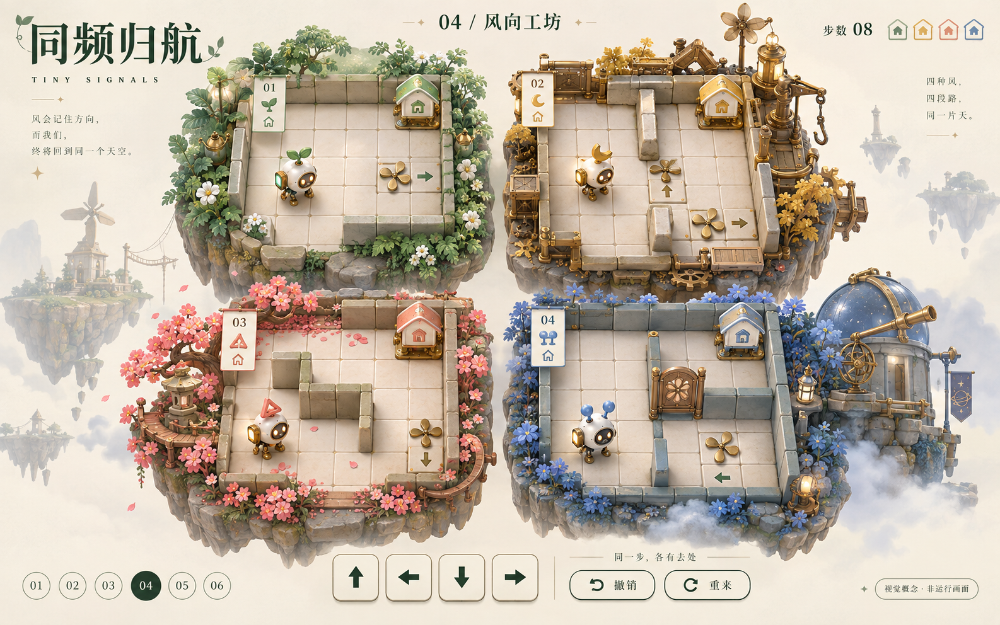
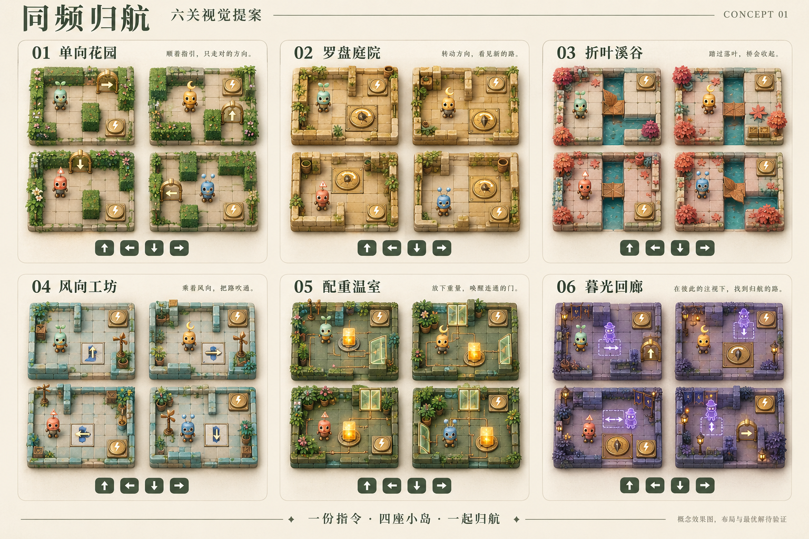

# 《同频归航》：六关视觉与机关设计

日期：2026-10-02。英文暂名：Tiny Signals。状态：首版六关可玩原型已实现；本文件保留视觉提案、规则设计和后续路线。

实现入口：[游戏源码与运行说明](../../games/local/tiny-signals/README.md)。当前包含六关、四棋盘同步输入、六类机关、撤销、预览、提示、最优星和本地进度。六关已通过联合搜索证明最少步数为 **8 / 10 / 13 / 10 / 12 / 13**。概念图仍是美术方向示意；实际地图以 `levels.mjs` 为准，实时画面使用可交互 SVG。

初轮交付主界面概念图、六关视觉总览、机关规则和分阶段实施方案。概念图用于确认角色、材质、场景与信息布局，不是可运行截图；图中的步数属于界面示例。后续已实现的六关使用独立的实际地图数据，具体格子布局和最短路径均已验证。

玩法参考用户提供的 [4 SCREENS, 1 MOVE 商店链接](https://store.steampowered.com/app/5135220/4_SCREENS_1_MOVE/)及完整玩法介绍。当前环境未直接读取该商店页面。本方案保留四棋盘同步方向输入、阻挡产生位置差、到家锁定与无限撤销；角色、世界观、场景表现与机关交互重新设计，不使用参考游戏的美术资源或关卡布局。

## 1. 核心体验

**一份指令，四座小岛，一起归航。**

玩家发出一次上、下、左或右的指令，四只机械信使同时执行。墙、方向门和局部机关会让同一指令产生不同结果。找到合适的停顿、偏转与到家顺序，将四只信使送回各自的充能巢。

- 四块棋盘的空间和机关互相独立，仅共享原始方向输入与回合序号。
- 默认一次移动一格；罗盘可能改变本地执行方向，风场可能追加一次位移。
- 四只信使能力相同，不用隐藏角色数值制造差异。
- 某只信使进入家后立即锁定，其棋盘冻结；其余棋盘继续。
- 无时间压力；每次有效接收的方向输入算一回合，即使四只全部撞墙。
- 只有输入推进机关，观察、暂停、打开规则说明不推进回合。
- 任意回合可以撤销；失败也能撤销上一回合，或重新开始本关。

## 2. 角色与视觉语言

四只信使使用奶白陶瓷外壳、黄铜小脚、发光面罩和背灯。它们是可以读出朝向与移动动作的小机械角色。

| 信使 | 外形识别 | 配色 | 家的标记 |
| --- | --- | --- | --- |
| 芽芽 | 双叶芽天线 | 鼠尾草绿 | 叶芽 |
| 月月 | 弯月天线 | 蜂蜜金 | 月牙 |
| 棱棱 | 三角天线 | 珊瑚橘 | 三角 |
| 泡泡 | 双圆天线 | 雾霭蓝 | 双圆 |

颜色始终配合轮廓与符号，静音和色觉差异不影响基本判断。不同信使的性格通过待机和到家动作表现，不改变规则。

棋盘采用固定朝向的俯视方格，浅立体墙体增加模型感；屏幕上方始终是“上”。不旋转镜头，也不使用会使方向产生歧义的菱形棋盘。装饰集中在棋盘边缘，不能遮挡可通行格、出口或机关箭头。

界面使用暖白底色、深松绿文字、柔和阴影。四块棋盘始终同屏，单套方向键位于底部；撤销、重来、关卡选择位于稳定位置。手机横屏优先；竖屏仍保留四棋盘总览，允许点按查看局部规则，避免只能看见一块棋盘。

### 主界面概念：04《风向工坊》

### 六关视觉总览

## 3. 机关与陷阱

首批六类机关围绕方向、路线、回合和占位展开。规则以本节为准；效果图中的摆放尚需调整为合法的关卡数据。

| 机关 | 规则 | 造型与反馈 | 解谜作用 |
| --- | --- | --- | --- |
| 单向风门 | 位于相邻两格之间的边上，只允许沿箭头穿过；逆向尝试留在原地。对角色、箱子、巡检残影都生效。 | 不对称黄铜帆门；门槛直箭头；被挡时帆片轻颤。 | 为不同棋盘创造单向通路和可控停顿。 |
| 罗盘转台 | 进入地砖后获得一次顺时针90°偏转，只影响这只信使下一次原始输入；撞墙也消耗。停留不再充能，不叠加。 | 平面铜制罗盘；头顶保留待用弯箭头；操作预览显示真实执行方向。 | 同一输入产生不同本地方向，要求提前安排下一步。 |
| 折叶桥 | 桥格被角色或箱占用后，某个移动子步骤结束时变为无人占据，就永久折起。断口不可进入，直到撤销或重开恢复。 | 铰接铜叶跨越窄水渠；完整、承重、折起三态。 | 经过就改变连通性，迫使玩家安排往返顺序。 |
| 换向风场 | 主移动后，站在风轮地砖上的信使按回合开始时的箭头再移动一格；每轮最多一次，不连锁，不推箱。回合末箭头顺时针转90°。 | 风轮和实心直箭头；淡色弯箭头提示下回合朝向。 | 借墙推进风向，再选择进入时机；不同棋盘可有不同初始朝向。 |
| 配重灯箱与闸门 | 灯箱可沿本地执行方向推一格，不可连推。角色或箱子压住圆盘请求开门，状态在回合末更新；门格被角色、箱子或残影占据时延迟关闭。 | 发光灯箱、图形匹配的压板与花瓣闸；铜线标明本棋盘内关联。 | 用重量留下通路，安排谁先经过以及箱子的停放位置。 |
| 一拍残影 | 独立巡检投影，第一回合不动，之后执行上一回合原始全局方向；与信使碰撞则本轮失败。它不受罗盘和风影响、不推箱、不触发地砖。 | 紫色线框巡检灯；虚线标明下一落点；不使用飞箭或尖刺造型。 | 玩家既安排信使的当前行动，也安排残影的下一拍。 |

### 明确的边界

- 所有位移遵守墙、棋盘边缘、收拢的桥、当前门状态与单向风门；被阻挡就停下。风不能把角色挤进箱子或推出棋盘。
- 灯箱只由角色的主移动推动；风场不推动箱子，箱子不受罗盘偏转。箱子不可推入家或残影当前格，不可一口气推动两个箱子。
- 转台只由角色进入触发。一次偏转在主移动前消耗；即使随后又进入转台，也只获得供下一回合使用的一次偏转。
- 折叶桥在每个移动子步骤结束后检查占用；角色推走桥上的箱并占据同一格时，桥不会在角色脚下收起。残影不承重，也不让桥收起。
- 压板和闸门在同一棋盘内连接，首版每门绑定一个压板。回合开始时门状态冻结，因此本轮刚压下开关不能在本轮风场位移中提前通过闸门。角色、箱子或残影占门时显示“待关闭”；残影不会压下压板。
- 残影有自己的起点，首批教学图与信使至少相隔三格。它遵守实际地形、单向门与回合开始的闸门状态；箱子会挡住它，家禁止进入。它不触发或消耗罗盘、风轮、压板、折叶桥。
- 角色主移动或风场移动进入残影当前格，立即记录碰撞；残影后移入角色格也算碰撞。不能通过交换位置互相穿过。
- 每格只放一种地面机关；家、罗盘、风轮、压板、桥不重叠。墙与闸门不可重叠。单向风门是边属性，但首批地图不把它叠在闸门边缘，降低阅读负担。
- 普通死路不自动判负。箱子卡角、桥断开可能导致无解，但没有完整证据时不显示“已死锁”；玩家可撤销或重开。

## 4. 首批六关

六关是体验原型的设计目标，不预先承诺370关。第01关开局先引导一次普通同步移动，再解释其单向门；每关只首次教学一种新机关。

| 关卡 | 建议尺寸 | 场景 | 新规则 | 四棋盘编排与学习目标 |
| --- | --- | --- | --- | --- |
| 01 单向花园 | 每盘5×5 | 鼠尾草庭园 | 同步移动、墙、单向风门 | A直达、B墙边对齐、C绕单向门、D先到家；理解一只停住时其他仍能走。 |
| 02 罗盘庭院 | 每盘5×5 | 蜂蜜色铜制中庭 | 罗盘转台 | 各盘最多一个转台，起点和出口错位；观察相同输入如何变成本地不同方向。 |
| 03 折叶溪谷 | 每盘6×6 | 珊瑚植物与浅水渠 | 折叶桥 | 桥放在明显瓶颈；在走捷径与保留返程之间做选择，提前安排到家顺序。 |
| 04 风向工坊 | 每盘6×6 | 青绿风轮浮岛 | 换向风场 | 风轮初始朝向不同，提供安全停步区；学会主移动与追加移动，以及撞墙推进风向。 |
| 05 配重温室 | 每盘6×6 | 深绿温室与灯箱 | 灯箱、压板、闸门 | A先教单箱单门，其他棋盘加入墙或单向门；看清开关在回合末生效。 |
| 06 暮光回廊 | 每盘6×6 | 雾紫观测站 | 一拍残影 | 残影分别搭配单向门或罗盘；单盘最多两类机关，全关最多三类，强调上一拍与下一拍。 |

每个主题后续可扩成“认识规则 → 独立运用 → 两机关组合 → 精简步数”小章节。扩图时改变拓扑、时序和到家顺序，不能仅镜像、换皮或增加障碍物数量。风轮与折桥、风轮与压板、罗盘与残影等组合留给下一批关卡。

## 5. 一回合如何结算

结算采用确定性整数格坐标，与帧率和动画时长无关。实现时先计算完整的新状态，再按事件列表播放动画。

第0回合初始化及重开时，先根据初始角色、箱子占位计算压板与有效门状态；桥全部展开并记录是否已经被占用，风向采用关卡初始值，罗盘无待用偏转，残影待执行方向为空。初始角色、箱子与残影不得同格；若关卡配置角色已在家，则立即锁定该棋盘。

1. 接收一条原始方向，保存完整撤销快照；锁定本轮风向、有效门状态、残影待执行方向。
2. 四棋盘分别消耗罗盘偏转，执行信使的主移动和必要的推箱，先检查碰撞合法性。
3. 处理转台进入、桥占用变化；信使到家立即锁定，该棋盘后续阶段跳过。
4. 未到家的信使按本轮初始风向执行至多一次风场位移，再处理进入、离开、碰撞和到家事件。风使用更新后的桥状态，以及回合开始时的门状态。
5. 未冻结棋盘的残影执行上一拍原始方向，检查与信使碰撞。初始待执行方向为空，所以第一拍待机。
6. 未冻结棋盘重算压板与闸门，旋转风轮，记录当前原始方向供下回合残影使用。随后全局步数统一加一，仅加一次，包括失败拍与最后全部到家的通关拍。
7. 四棋盘统一展示这一拍结果；任何棋盘失败则整关进入失败态；否则四只都到家则通关。

失败仍保留整轮前的快照。撤销恢复四棋盘状态、机关状态、到家锁定、上一拍方向、步数和失败标志。撤销后新的输入覆盖原有未来分支。重开回到该关同一初始状态，不随机更换布局或机关相位。

## 6. 输入、可读性与成绩

- 键盘方向键/WASD，以及鼠标或触摸方向按钮；之后添加手柄D-pad。按下一次产生一次输入，默认不启用系统按键连发。
- 撤销提供按钮与Z；重来提供按钮与R。移动动画期间至多缓存一条下一输入，避免长按无意走出多步；打开说明时阻止移动输入。
- 方向预览显示所有未到家角色的本地执行箭头、风场追加箭头和残影下一落点。手机可先点按机关查看说明。
- 上方显示已到家数量与当前路径步数；下方保留稳定的撤销入口。所有失败说明指出具体棋盘与碰撞对象。
- 通关保存个人最佳步数；撤销回退路径，因此最少步数榜记录最终合法解的长度。使用提示的成绩单独标识。
- 只有精确求解证明最短路线后，才显示“最优N步”和最优星。仅有一条已知解时只能标为“参考路线N步”。
- 求解以四棋盘联合状态搜索，不能将各盘独立最短路相加。状态包含角色、到家标志、箱子、桥状态、闸门状态、罗盘充能、风轮朝向、残影位置和上一拍输入。重复状态剪枝时不能丢掉机关相位。
- 计时玩法后置；若引入计时榜，撤销不回退真实计时，且与最少步数榜分开。

## 7. 分阶段落地

| 阶段 | 交付与验收 | 范围 |
| --- | --- | --- |
| A 视觉与规则 | 当前文档、主画面、六关总览；可逐项讨论角色、场景、机关和递进。 | 已完成概念设计。 |
| B 六关可玩原型 | 纯规则引擎、六关数据、四棋盘呈现、触控/键盘、撤销/重开、失败/通关、本地进度。逐关实际试玩并验证至少一条通关路线。 | 已实现并通过六关浏览器通关与最优解验证。 |
| C 内容与创作 | 扩成12–24关，经试玩决定篇幅；加入求解验证、关卡编辑、导入导出与同图挑战链接。 | 编辑器发布前校验起点、终点、地形、机关关系与可解性。 |
| D 社交与竞赛 | 好友合作、服务端验证的榜单、好友对战、再考虑公开关卡社区。 | 服务端身份、房间、回合与成绩验证逐项接入。 |

### 好友一起玩

2–4人共享同一组四棋盘。首先实现轮流执令：只有当前执令者可提交全局方向，其余人可标记格子和建议路线。输入仍同时作用四只信使。合作撤销由在线成员共同确认；断线暂停并允许重连；不因网络延迟自动跳过玩家。

后续可增加“提议方向 → 队友确认”的协作方式。每人独立控制一只角色属于另一套规则，不能直接作为本游戏的同步输入合作模式。

### 排行榜与好友对战

- 先做好友同图异步挑战：发出固定关卡版本和初始种子的挑战，对方使用相同条件，比较步数；同分并列。
- 然后增加好友实时竞赛：双方各自控制一整组四棋盘，服务器统一开始，比较完成结果。对手进度可以展示，但不引入影响对方棋盘的随机道具。
- 榜单按关卡ID、关卡内容哈希、规则版本与模式分组；修改地图或规则后不混算旧成绩。
- 服务端从初始状态回放最终输入路径，确认通关与步数；不得直接信任客户端上报的分数。榜单查询、提交需要幂等ID与重放校验。
- 实时竞赛的完成时间与撤销次数由房间事件记录；网络恢复策略单独验证，不能用客户端暂停表抹去时间。

## 8. 与现有平台的接入边界

代码实施时，建议在 `games/local/tiny-signals/` 建立独立 Game，提供 `GameDefinition.mount(target, host)` 与暂停、恢复、释放生命周期。纯规则模块不依赖 Shell、DOM 或网络；显示层消费状态和动画事件。独立模式注入本地 Game Host，嵌入模式接收 Shell 提供的 Game Host。

仓库已经有本地存档、云存档、比赛身份、邀请房间、动作幂等和持久化榜单的基础实现，但不能视为这个新游戏已经接入：

- 仅加入静态 iframe 清单不能自动获得 Game Host 云存档或 Runtime 版本选择。
- 当前 Game Host v1 包含 `content/storage/ads/telemetry/navigation`，尚无现成的排行榜或好友端口；接入时需补可选能力与适配器。
- 现有比赛榜键和有时限的房间不足以直接承载逐关最少步数、长期异步挑战；需要扩展关卡版本维度与挑战生命周期。
- 云存档身份与比赛身份当前分离，账号关联需明确设计。
- 合作同步采用按动作推进的状态机和命令序号，不复用卡丁车持续物理模拟。服务端保存房间版本、操作权、回合与状态哈希，原子验证并推进一拍。

实施依据：[独立游戏接入](../standalone-games.md)、[Game Contract](../architecture/game-contract.md)、[独立Game源码约定](../adr/0009-independent-game-submodules.md)、[Game自有关卡Schema](../adr/0007-game-owned-content-schemas.md)、[平台与渠道边界](../adr/0010-platform-runtime-and-channel-boundaries.md)。具体端口以 [Game Host接口](../../packages/game-contract/src/ports.ts) 为准；比赛基础见 [Runtime比赛实现](../../services/runtime-api/src/competition/store.ts)。

## 9. 后续实现的验证重点

下列规则已纳入首版自动化验证与浏览器验收；当前版本仍需后续玩家试玩和真机体验反馈。测试与限制见游戏目录的运行说明。

- 同一输入在四棋盘上可以分别造成移动、撞墙、偏转、到家；完成一盘不会使其他棋盘多执行或少执行一拍。
- 全部撞墙依然正确推进风向和残影；罗盘偏转撞墙后被消耗。
- 主移动与风场移动之间桥收起，不产生角色脚下提前塌桥；风移到第二风轮也不会连锁。
- 压板在回合末开门，占门延迟关闭；撤销完全恢复有效门状态。
- 残影首回合待机，之后复刻原始输入而非局部偏转；主移动碰撞、风场碰撞和交换位置均有正确结果。
- 对任意合法状态与方向，移动后撤销应恢复完整状态；相同版本与输入日志在客户端和服务端得到相同结果。
- 每个可发布关卡必须有合法通关回放。已证明最优、仅找到可行解、尚未验证三种状态明确区分。
- 四棋盘手机同屏可辨认，按钮触控范围足够，静音与减少动态效果下可完成所有操作。
