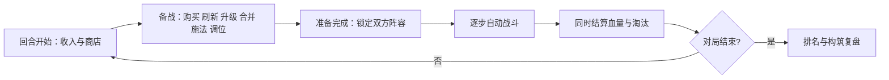

# H5 单人构筑自走棋：玩法总纲

版本：v0.1 草案 · 日期：2026-09-12 · 项目代号：multi-battle

关联：[文档入口](../../README.md) · [规则与验收](../rules-and-validation.md) · [流派与卡牌](../archetypes-and-cards.md)

> 本文是本次已实施的原创玩法基线；用户明确要求的机制为设计约束，人数、格子数、费用、概率、时长和卡牌数仍可调整。实际交付内容与测试边界见[实现与验证记录](../implementation-status.md)，设计目标不等于实测成绩。

## 1. 产品方向与取舍

玩家通过经营、调位、合并、施法、换装和转移等级主动塑造阵容，随后观看真实规则逐步驱动的自动战斗。胜负取决于阵容、资源分配和站位；战斗演出必须能解释这些选择产生的效果。

| 候选方向 | 优点 | 代价 | 本版决定 |
| --- | --- | --- | --- |
| 本地模拟八人淘汰赛 | 接近熟悉的自走棋体验，有排名、对手观察与运营压力 | 要维护 7 个对手的状态 | **采用：1 名真人 + 7 名本地机器人** |
| 单人逐关闯关 | 开发简单、关卡节奏容易控制 | 偏离用户提出的模拟其他玩家 | 后续可复用战斗规则新增 |
| 联网异步阵容镜像 | 可接触真实玩家构筑 | 需要服务端、匹配及版本管理 | 当前不安排 |

建议一局活跃游玩约 15–20 分钟，通常 12–18 回合。备战没有强制倒计时，允许暂停和恢复；这是时长目标，不承诺每局严格限时。美术暂用原创奇幻集市与佣兵主题，名称可以替换，机制 ID 保持稳定。

### 必须保留的用户需求

| 需求 | 落点 |
| --- | --- |
| 单人游玩，手机端随机模拟其他玩家 | MODE-01 本地八人对局 |
| 角色、法术、装备都可购买并有等级 | SHOP-01，统一使用道具品阶 T |
| 刷新花金币，自身等级花金币升级 | ECON-01、SHOP-02 |
| 只能刷出自身等级及以下的道具 | SHOP-03，T ≤ P |
| 角色多次直接叠加，等级暂无上限 | LEVEL-01，无三合一、无满级封顶 |
| 角色等级联动、A 向 B 转移等级 | LEVEL-02、LEVEL-03 与共鸣/传承流 |
| 战场、商店、手牌等位置有区别 | ZONE-01 |
| 战场或手牌角色可以直接卖出 | ZONE-04，固定少量金币 |
| 多流派，三类道具均有中立与流派组件 | CARD-01，6 流派 + 中立，共 48 张 |
| 所有机制留文档，方便后续改造 | 稳定规则/卡牌 ID、验收例、变更记录 |

## 2. 三种「等级」必须分开

| 名称 | 符号 | 作用 | 提升方式 |
| --- | --- | --- | --- |
| 指挥官等级 | P，1–5 | 解锁可以刷出的最高道具品阶 | 花金币直接升一级 |
| 道具品阶 | T，1–5 | 标记角色、法术、装备的获取门槛和机制强度 | 卡牌定义固定；不是局内养成数值 |
| 角色成长等级 | L，初始 1 | 增长角色属性，作为流派联动及转移的资源 | 同名叠加、法术、被动效果，可重复无限增长 |

例如：P2 玩家可以买到 T2、L1 的角色。把它养到 L30，不会让商店出现 T3；把指挥官升到 P3，也不会把所有角色变成 L3。法术和装备有品阶，本版不另做其经验、强化或合成系统。装备流通过装备相关效果培养角色。

## 3. 对局循环（MODE-01）



- 8 名指挥官各 30 点生命，P1、0 金、空战场、空手牌起步；第 1 回合正常获得 4 金和免费商店。
- 每人独立商店、资源、角色、手牌和随机序列。机器人没有真人在线身份；UI 显示「本地模拟」。
- 进入备战前确定并显示本回合对手，展示其上一回合最终阵容；第一回合显示暂无记录。
- 玩家点击「准备完成」后锁定自己的状态，机器人结束经营，然后生成本回合战斗快照。战斗阶段不能改变经营状态。
- 各组战斗按同一规则完成，再一次性结算全大厅血量；不能按动画播放快慢提前淘汰别人。
- 真人淘汰即可显示最终名次并结束本局，无须等待机器人争冠军。剩余 1 人时立即结束；最多第 18 回合强制收官。
- 第 18 回合仍有多人：生命值高者优先，其次累计胜场，最后使用开局已确定的随机席位优先级。告知玩家是「回合上限排名」，不伪称全部击败。
- 同一回合多人淘汰按结算后的生命值高者优先，再比较累计胜场和开局席位优先级；负生命值参与比较，UI 可显示为 0。

### 战败伤害与节奏

第 r 回合基础伤害 `b = 2 + floor((r - 1) / 4)`。败者受到 `b + 胜者存活的非召唤角色数`，后半项最多 6。平局双方各扣 b；胜者不扣血，获胜不额外发金币。召唤物可帮助获胜，但不抬高结算扣血。

例如第 7 回合 b=3，胜方剩 2 名本体与 3 个召唤物，败者扣 5 血。此设计使堆召唤和高等级单核都有战斗价值，同时允许经济路线承受有限的过渡损失。

## 4. 金币与升级（ECON-01）

金币仅是局内资源，当前设计没有充值兑换局内金币。

| 项目 | v0.1 数值 | 说明 |
| --- | --- | --- |
| 每回合基础收入 | `min(3 + r, 12)` | r 从 1 开始；4、5、6…12，此后保持 12 |
| 余钱 | 全额保留 | 无利息、无连胜/连败金币奖励 |
| 买角色基础价 | 3 金 | 所有品阶同价；高阶价值由解锁成本与概率控制 |
| 买法术基础价 | 2 金 | 买入手牌，施放不再扣金币，卡牌消耗 |
| 买装备基础价 | 3 金 | 买入手牌，穿脱不收费 |
| 手动刷新 | 1 金 | 已冻结商店也可刷新，届时清除冻结 |
| 回合开始自动刷新 | 免费 | 冻结时跳过一次，不算付费刷新 |
| 升级 P1→P2→P3→P4→P5 | 5 / 8 / 11 / 14 金 | 点击直接升级；无经验条、无自动折扣 |
| 卖角色 | 1 金 | 战场/手牌相同，L 和 T 不提高卖价 |
| 卖手牌法术或装备 | 1 金 | 不触发角色出售效果；已穿装备先脱下 |
| 卡牌效果额外产金 | 每名指挥官每回合合计最多 3 金 | 不含正常出售收入、基础收入；多人之间不共享额度 |

没有免费的同名回收或退货。3 金买一个角色、1 金卖掉，净花费 2 金；额外出售收益受独立的 3 金产金额度约束。明确的卡牌效果可降低当前商品价格，最低1金；折扣不属于额外产金。所有计次与额度每回合开始重置，不能通过上下场、合并或重新读档重置。

### 一条可负担的经营路线

下面是「刚好刷到所需道具」的预算例，不是强制教程或必胜策略。显示回合结束后的金币；刷新花费发生在相应购买之前。

| 回合 | 收入 | 本回合花费 | 结束金币 | 阵容/等级 |
| --- | --- | --- | --- | --- |
| 1 | 4 | 买 1 角色：3 | 1 | 1 人，P1 |
| 2 | 5 | 买 2 角色：6 | 0 | 3 人，P1 |
| 3 | 6 | 升 P2：5 | 1 | 3 人，P2 |
| 4 | 7 | 刷新 1 + 买 2 角色 6 | 1 | 5 人，P2 |
| 5 | 8 | 升 P3：8 | 1 | 5 人，P3 |
| 6 | 9 | 刷新 1 + 买角色 3 + 装备 3 + 法术 2 | 1 | 6 人，P3 |
| 7 | 10 | 升 P4：11 | 0 | 6 人，P4 |
| 8 | 11 | 刷新 1 + 买同名角色 3 + 法术 2 | 5 | 合并后仍 6 人，P4 |
| 9 | 12 | 升 P5：14 | 3 | 6 人，P5；余 3 金可选择继续操作 |

18 回合基础总收入 180 金；升到 P5 共 38 金。纯存钱最早第 6 回合能承担全部升级，但空场会承受严重损血；上述路线只验证预算可达。真正的升级时机需对比当下保命与后期机制收益。

## 5. 商店（SHOP-01 / 02 / 03）

每次生成 **5 格：3 个角色 + 1 个法术 + 1 个装备**。每格独立先抽品阶，再在对应类型、品阶的牌中等概率抽一种；有放回，可重复。各玩家不共享有限牌库，没有卡池被机器人买光的问题。

| 指挥官 P | T1 | T2 | T3 | T4 | T5 |
| --- | --- | --- | --- | --- | --- |
| 1 | 100% | 0 | 0 | 0 | 0 |
| 2 | 65% | 35% | 0 | 0 | 0 |
| 3 | 40% | 35% | 25% | 0 | 0 |
| 4 | 25% | 30% | 30% | 15% | 0 |
| 5 | 20% | 25% | 25% | 20% | 10% |

- 类型和品阶均以牌库定义为准；某类型某品阶没有卡时，移除该品阶权重并重新归一化，绝不补发 T>P 的卡。每种类型必须存在 T1 入门牌。
- 未购买的新角色默认 L1。仅明确写「商店」的效果可修改当次商品实例等级。
- 购买后格子留空，本回合不自动补货。手牌满时禁买；不会直接自动装备、自动施法或自动合并。必须先腾位置。
- 指挥官升级立即改变之后刷新的概率，不重抽现有商品；不额外赠送刷新。
- 冻结是免费全店开关。开启后，下次备战开始保留未买商品及其商店增益，已买的空格补一次新货，然后自动解除冻结。补位不算一次刷新事件。
- 手动付费刷新销毁全部旧商品、生成新 5 格、解除冻结，随后触发付费刷新效果；旧商店累积的等级不会继承给新商品。
- 法术全店刷新也解除冻结；法术只刷新某类型格子时保留冻结开关，下一回合冻结作用于当前剩余商品。两者都不算付费刷新。
- 不设首版隐藏保底、流派定向暗调或局外属性加成。卡池较小时先验证上述简单分布，再决定是否需要玩家可见的定向机制。

## 6. 构筑的六条主线（CARD-01）

不另加「凑 3 个同阵营自动 +20%」的第二套羁绊。流派标签用于查找和解释；真正的联动来自卡牌之间的事件与资源关系，可以跨流派组合。

| 流派 ID | 玩家主要操作 | 收益路线 | 必须存在的弱点 |
| --- | --- | --- | --- |
| resonance 共鸣成长 | 找同名、施放成长、让队友监听成长事件 | 单次培养带动其他角色 | 占辅助位置；传导收益不能无限递归 |
| legacy 传承换核 | 先养过渡角色，再将成长转给高阶核心 | 前期投资可带到后期 | 转移花钱且源角色降级；分散火力能压单核 |
| commerce 商贸刷新 | 付费刷新、买卖过渡角色、利用商店增益 | 找牌同时积累战力，有限回收金币 | 花在刷牌的钱不能同时升级；收益有额度 |
| arcana 咒术连施 | 连续购买/施放法术，安排本回合出牌顺序 | 施法转成长或下场战斗优势 | 依赖持续购买，准备效果一战消耗 |
| armory 军械锻造 | 选择装备持有人，培养主坦与主输出 | 装备属性与持有者能力放大 | 每人两个装备位；不能免费穿脱刷收益 |
| ember 余烬牺牲 | 预备献祭、安排前排阵亡与召唤次序 | 阵亡转为临时攻击、治疗、伤害或场上接力 | 本体较薄，召唤不加结算伤害且受数量约束 |

建议前期不锁定流派。拿到一张发动机和两张可用组件后形成方向；P3 左右选择继续投资或用等级转移换核。最终 6 格通常由 1–2 个核心、2–3 个发动机/前排、1–2 个中立针对位构成，具体以 [卡牌库](../archetypes-and-cards.md) 为准。

中立道具提供稳定前排、补伤、成长、基础转移、护盾或拆盾等通用功能。流派专属牌应在对应循环中更高效，但中立牌必须能独立撑过过渡期，不能强迫开局抽中指定发动机。

## 7. 手机交互与战斗反馈

默认手机横屏，竖屏也能完成经营，不强制依赖全屏 API。逻辑战场 6 格，前排 3 格、后排 3 格；没有寻路与拖动走位，站位决定攻击顺序和前后排承伤关系。

```text
┌──────────────────────────────────────────────┐
│ 回合 / 自己生命 / 对手预告 / 暂停             │
│ 敌方上轮阵容摘要（点开查看）                  │
│ 我方前排：          □ □ □                    │
│ 我方后排：          □ □ □                    │
│ 商店：角色  角色  角色  法术  装备             │
│ 手牌（横向滚动）        金币 / 升级 / 刷新     │
│ 选中卡牌操作区：出战 合并 使用 卖出   准备完成│
└──────────────────────────────────────────────┘
```

- 点击选中再点击目标是完整可用的主操作；拖拽是补充。商店点卡看详情，再点购买，防止滚动时误买。
- 备战时敌方只占摘要一行，查看详情暂时替换商店区域；战斗时隐藏商店与手牌，展开双方各两排。避免在手机横屏同时挤进两套完整战场与经营界面。
- 同名合并由玩家选择保留哪一个实例，预览结果 L、属性及装备去向，不强制自动合并。
- 双目标转移法术分两步选 A、B，直接显示「A：L21→L1，B：L4→L24」。取消或目标失效不消耗卡。
- 角色从战场或手牌选中后可点卖出，按钮显示「+1 金」。带装备或较高等级时用卡片内二次确认展示损失，不弹连续系统确认框。
- 战场满时拖向已占位置是交换，不是覆盖销毁。手牌角色替换战场角色会让旧角色进入原手牌位置。
- 商店品阶用 T 徽标，成长等级用明显的 L 数字，指挥官 P 旁列出下一阶解锁内容。颜色之外保留文字/图形提示。
- 主要触控目标至少 44 CSS px，适配安全区域，卡牌详情可放大，手牌可滚动；不依赖 hover。拖动取消、切后台、来电后不会重复购买或留下半个转移动作。
- 进入战斗后商店和手牌区域让位于战场与事件日志。提供 1× / 2× / 快速结算、暂停、音效开关；快速结算仍执行同一规则。
- 每次命中有攻击来源与目标动画、伤害数字、护盾变化；升级有等级跳字，传承有 A→B 等级流动，召唤有新角色登场。声音在首次用户手势后启用，静音偏好保留。
- 结算列出伤害公式、关键连锁、阵容成长和金币用途，玩家能理解「这次输了为什么」，不只给战力评分。

## 8. 本地模拟对手（BOT-01）

对手有自己的持久阵容与经济轨迹，不能每回合直接随机捏一个与玩家战力相当的阵容。随机用在初始偏好、商店、候选选择、首攻抽签及牌面明确写明的随机目标，状态改变必须来自合法操作；同等普通攻击目标按站位选择。

1. 开局为 7 个机器人分配六流派偏好；第 7 个随机重复一种，再分配偏进攻/偏升级的经营权重。
2. 每回合与真人同时收到基础收入与免费商店。根据自身已有组件、可见上回合对手阵容、生命和预算决定补战力或升级。
3. 先保留合理数量的战场角色，再在合并、补核心、买法术、装备、升级、刷新中评分选择；同分时按独立种子抽选。不读取真人本回合未公开手牌和未来随机结果。
4. 同名材料手动合并，法术选合法目标；只有能提高阵容时才出售/替换。没有有益且可负担的动作就准备完成，不把刷新当无限默认动作。
5. 简单难度降低组合决策质量；标准难度按上述规则经营。当前不以暗加金币/角色等级模拟难度，也不设计尚未验证的困难模式。

正常每个机器人每回合最多执行 40 次决策步骤作为手机计算预算，达到后保留合法当前状态并准备。这个是机器人思考预算，不是玩家行动次数上限，也不是角色等级上限。

配对：存活者按种子打乱后两两分组，优先避免连续两回合重复；无法避免时正常复赛。人数奇数时，按轮转选一名本回合打镜像，镜像取一个已淘汰者最后一次锁定阵容；其余存活者两两配对。镜像无经济、无真实血量，结果只影响挑战者；保留原阵容但无永久成长回写。镜像连续承受者优先避让。8 人开局首次变奇数时一定已有淘汰快照。

## 9. H5 实现边界与存档

这节记录H5实现边界，当前源码按原生ES模块组织。

- 首版一个静态 H5 项目即可，不建账户、服务端、排行榜和同步协议。经营界面优先 DOM/CSS；战斗可使用同一角色组件表现，实际性能不足再决定是否使用 Canvas。
- 规则更新返回新状态和事件列表，界面消费事件进行动画。真人和机器人调用相同合法动作入口；无需先造通用技能脚本语言或插件系统。
- 战斗使用锁定阵容的副本，永久状态与临时攻击/生命/护盾/召唤分开。不能让视觉播放回调决定伤害或随机结果。
- 种子分开保存：商店、每个机器人经营、配对、各场战斗分别推进。查看卡牌、切速、播放粒子不消耗规则随机数。
- 保存一个进行中对局和设置即可，含 rulesVersion、contentVersion、schemaVersion、回合、8 人状态、累计胜场、开局席位优先级、上轮配对、镜像轮转记录、已淘汰快照、计数器、所有随机状态以及已锁定战斗快照。每次完整经营动作后提交保存。
- 战斗被打断可从该战斗锁定快照与种子重新播放；回合结算以已结算标记避免重放后重复扣血/发收入。无需第一版保存每帧动画状态。
- 存档读取先校验版本与数据；损坏或不兼容时保留旧数据并提供显式新开局操作，不静默覆盖。存储失败提示当前未保存，允许导出存档 JSON；不能显示假保存成功。
- 大等级不得使用 999/9999 截断。等级、攻击、生命使用精确整数运算，存档为十进制字符串；详情显示精确值，卡面允许万/亿等短显示。具体要求见 LEVEL-04。
- 首版按局内规则平衡；不引入局外永久属性成长影响公平比较。收集图鉴、每日种子和新模式放到玩法已验证之后。

## 10. 分阶段实现与验收门槛

| 阶段 | 要交付的实际可玩内容 | 进入下一阶段的条件 |
| --- | --- | --- |
| D0 当前 | 本总纲、规则/验收、六流派48卡设计 | 设计评审及用户提出的调整记录完毕 |
| M0 规则原型 | 完整经营回合 + 真实逐步战斗 + 本地机器人 + 存档；先接入共鸣/传承/商贸18张和中立12张，共30张 | 完成购买到结算全链路；3 流派能成型；关键边界通过 |
| M1 完整设计集 | 接入其余18张，六流派48张，机器人能识别全部机制，完整18回合与排名 | 六流派各能完成一局；跨流派组合与转型可用，排除无成本循环 |
| M2 体验与数值 | 手机操作、声音、动画、战报、难度和经济调整 | 真实手机与浏览器检查，证明卡组有差异且操作有反馈 |

M0 的 30 卡只是验证子集，不能宣称六流派已完成。每个子集启用时都应用「可用品阶重新归一化」规则并检查 T1 类型覆盖。M 表示实现里程碑，与指挥官等级 P 分开。

数值验证目标：第 3–5 回合能形成初步方向；标准路线大约第 8–11 回合能升 P5；多数正常对局在第 12–18 回合结束。这些均未测试。原型中对相同种子轮换流派与席位，记录首次核心回合、各回合金币去向、等级分布、伤害来源、胜率、转型成功率及局长，至少覆盖每流派 30 局后才作首轮调参判断；不把小样本排名当成平衡结论。

## 11. 设计决策与后续修改

| 决策 ID | 本版选择 | 为什么 | 何时重审 |
| --- | --- | --- | --- |
| D-01 | 5 个指挥官/道具品阶 | 让手机一局内有完整升级阶梯 | P5 内容过挤或升级选择不足 |
| D-02 | 角色无成长上限，线性属性 | 保留用户要求的持续叠加，避免指数膨胀 | 先调收入/联动，不能暗加等级封顶 |
| D-03 | 转移只搬 L−1 | 等级资源守恒，源角色保留基础1级 | 新法术明确消耗源角色时另立规则 |
| D-04 | 6 格、两排各3、自动轮流攻击 | 站位可解释，手机显示与技能范围可控 | 实测缺乏战术空间再增加移动 |
| D-05 | 固定类型商店、独立牌池 | 保证三类道具持续可获得，本地模拟简单 | 重复内容或刷牌挫败感明显 |
| D-06 | 无利息、固定价格、无胜负金币 | 把决策集中在升级、找牌和构筑 | 运营选择过于单一时单独测试 |
| D-07 | 装备固定品阶、角色承担养成 | 避免额外强化系统抢占第一版重心 | 核心构筑成熟后确有装备养成需求 |
| D-08 | 流派事件联动，无人数羁绊 | 支持自由混搭 | 仅在新系统增加明确决策时重审 |

修改流程：先描述改变了哪个玩家决策 → 修改对应规则 ID / 卡牌 ID → 更新边界例 → 用相同种子对比旧版 → 在下表留变更。改名不换卡牌 ID；删除 ID 不给另一张卡复用。改变结算语义提升 rulesVersion，改数值/卡池提升 contentVersion，改保存格式提升 schemaVersion。进行中的旧局继续旧版本需要保留旧内容；首版若未实现兼容，明确提示无法继续并保留旧档供导出。

| 日期 | 版本 | 改动 | 原因与验证 | 存档影响 |
| --- | --- | --- | --- | --- |
| 2026-09-12 | v0.1 | 建立经济、等级、区域、战斗、模拟对手及48卡六流派草案 | 来自用户需求；只完成文档审查，未运行游戏 | 尚无游戏存档 |
| 2026-09-12 | v0.1 实现 | 全部48卡、经营、逐步战斗、本地8人、存档和界面落地 | 见实现与验证记录；机器人保留升级差额、镜像按次数公平轮转 | 建立schema/rules/content版本1；BigInt以十进制字符串标记保存 |

待验证问题：实际局长；转移是否成为必买；低阶发动机是否压倒高阶；军械流能否抵挡成长爆发；独立牌池下找核心所需刷新次数。后续逐项用试玩和固定种子实验回答，不先叠加更多系统。

## 12. 参考范围

用户提到酒馆战棋、云顶之弈及《王者万象棋》。后者的开发者商店介绍公开强调刷新、养成和角色事件联动，可作为体验方向参考。[腾讯开发者发布的《王者万象棋》App Store 介绍](https://apps.apple.com/cn/app/%E7%8E%8B%E8%80%85%E4%B8%87%E8%B1%A1%E6%A3%8B/id1614798032)（查阅于 2026-09-12）。

本文中的 8 人本地模拟、5 品阶、金币表、成长/转移公式、48 张卡和六流派均是本项目提案，不声称复刻上述产品的现行规则。没有采用第三方攻略中的未核实具体机制。
