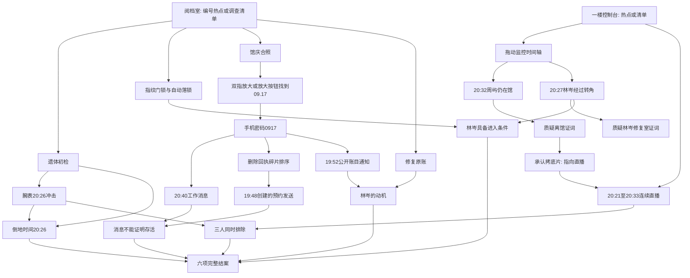

# 证据依赖与玩家可达性

所有场景从开案后可进入；问题、手机内部内容与推理结论逐步解锁。下图中物理证据均在游戏开场存在。

## 证据板组合规则

| 输入A | 输入B | 推理ID | 结果 |
| --- | --- | --- | --- |
| message | schedule | scheduled-message | 发送时间不等于存活时间 |
| body | watch | death-time | 致命袭击发生在20:26 |
| lock | camera-lin | lin-access | 林岑在关键窗口进入现场 |
| ledger | threat | motive | 21:00曝光原账的压力 |
| livestream | watch | exclusion | 三名非凶手在关键时间不在场 |

任意其他组合不会生成事实。证词本身以 statement:<问题ID> 的板卡出现：statement:lin-where + camera-lin / statement:zhou-where + camera-zhou 等组合指向审问，不替代玩家当面质疑。人物卡可用于浏览资料，没有自动定罪功能。

## 解锁问题

各人初始可问关系、行踪、对20:40消息的看法；个人秘密话题分别由 threat / camera-zhou / transfer / maintenance 解锁。表面证词只在玩家主动询问时显示并入板。质疑后保存改口口供。

## 渐进提示

按尚未满足的第一个阶段提示：现场伤势和腕表 → 相框铭牌 → 手机密码 → 删除回执排序 → 主监控20:27和20:32 → 直播缓存 → 林岑行踪质疑 → 五组证据板 → 六项结案。每阶段三档，切换阶段重置提示档位；提示不扣分，清晰列出小游戏的可访问替代操作。

## 三条回归路线

1. 高效：关键现场 → 相册/手机 → 恢复 → 监控 → 直播 → 林岑质疑 → 五组组合 → 正确六项，S。
2. 错误怀疑：先问周屿和许曼，用茶杯等错误证据多次质疑；错误手机密码、碎片、监控抓拍、板卡组合与错误指认；继续取得关键证据后完整结案，A（低于90分）且没有死局。
3. 缺少非关键线索：不调查停钟、茶杯、普通书籍、备用金、维护秘密；仍可收集全部关键证据、建立结论并S结案。

每条浏览器路线还检查刷新续玩、关闭弹层、触屏尺寸、最终报告与回到调查。单元自检验证数据引用完整、六项评分、幂等取证与存档恢复。
