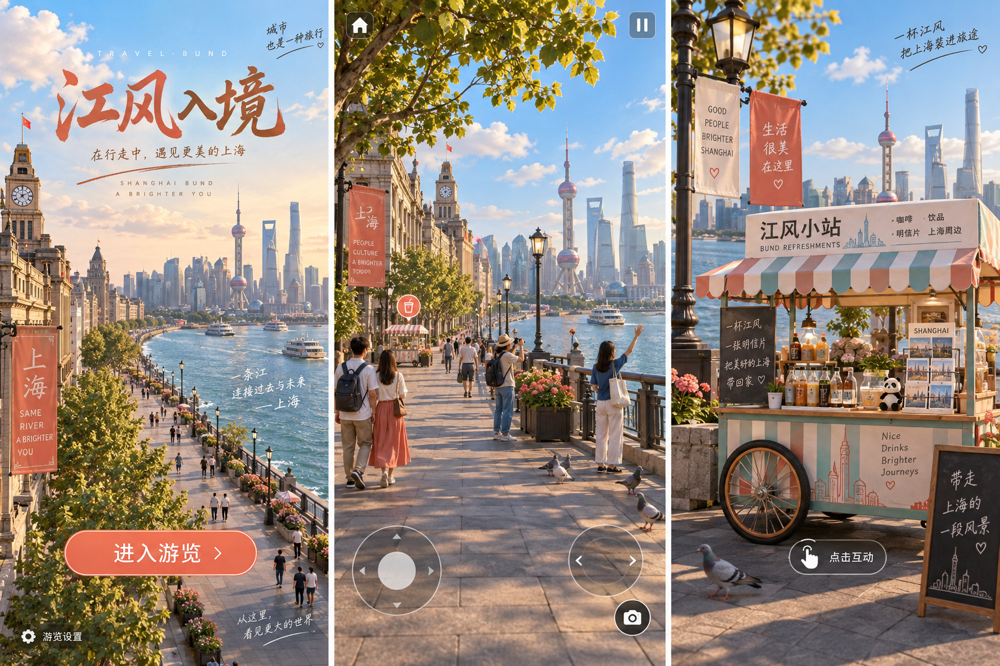
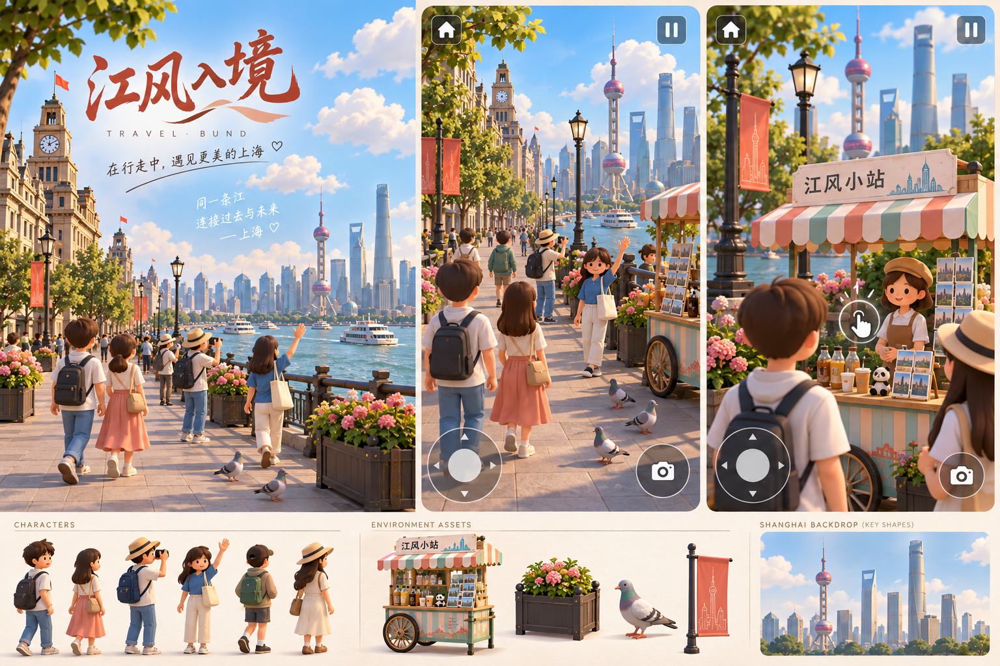
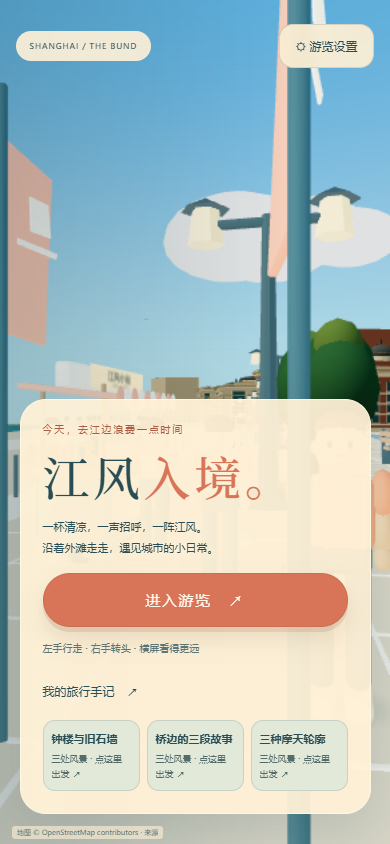
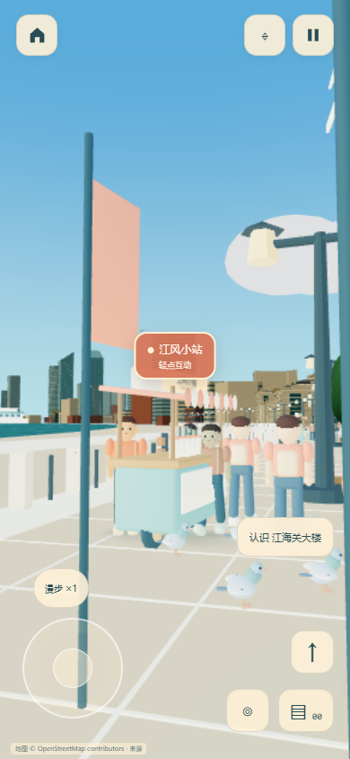
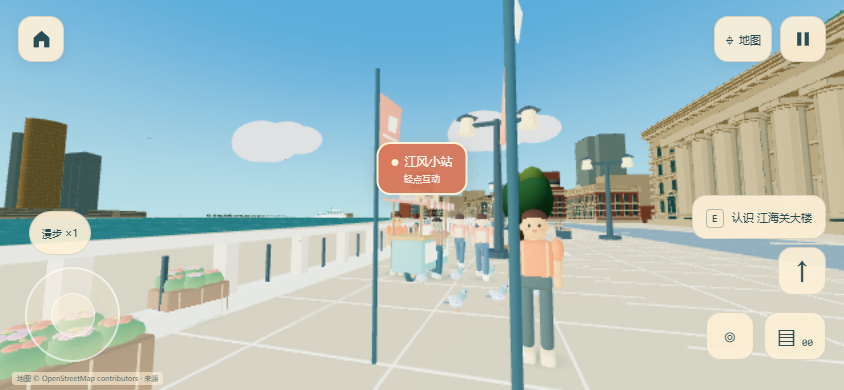

# 外滩的生活感 · 2026-10-05

最新路面、岸线、行人碰撞、图片首页和面板修正见 [本轮设计与实景](revision-2026-10-05/README.md)。下文保留第一轮记录。

保留既有外滩建筑和地理布局，增加暖色光线、江水、白云、街边绿植、花箱、条纹小摊、不同色调的游客、鸽子、飘带与远处飞鸟。移动端以左手摇杆和右手环顾为主，互动提示跟随场景中的对象。首页提供进入游览、游览设置、手记和路线入口；游览时只显示必要控件与返回首页。

## 效果图与修正



第一版确定暖阳、青蓝江水、珊瑚红与薄荷绿的生活设施。照片式树叶、复杂人物面部、密集阴影不能直接作为手机渲染预算。



修正版保留建筑尺度与可识别的外滩轮廓，人物采用简单圆润的关节模型。图片是 imagegen 内置工具生成的视觉目标，**不是游戏截图**。实际实现复用已有建筑、树和碰撞；新增设施由本机 Blender 原创建模。首轮实景发现小摊遮挡远景，随后将其移到侧前方，调整入场朝向与手机标题尺寸，增加近处绿植和接触阴影。

## 实景







以上截图来自生产构建的完整场景，Chrome 手机视口和真实 CDP 触摸事件。实际画面采用较简洁的材质、人物和植被；没有用效果图冒充运行画面。

## 模型与组装

- `assets/bund/build-life.py`：可重建模型的 Blender 脚本。
- `assets/bund/source/bund-life.blend`：可编辑源文件，四肢保留肩部与髋部轴心。
- `assets/bund/runtime/life/street-life.glb`：人物五个部件、鸽子三个部件、小摊、花箱和飘带，共 11 个网格，15,006 个三角面、602,788 字节，无外部贴图依赖。
- `assets/bund/previews/bund-life.png`：从真实导出的模型渲染的素材预览。
- `src/life.ts`：既有步道上的布置、活动路线、附近筛选和实体碰撞位置。
- `src/StreetLife.tsx`：共享模型实例化，行走、挥手、鸽子起落、飘带、白云与飞鸟动画，贴合对象的交互提示。

步道模型包只在附近需要时加载。最多启用附近 75 米内的五个生活片段；远处片段卸载，已下载模型继续复用。已有建筑的分块加载、请求并发上限和碰撞资料保留。新增树复用原有低面树，不增加依赖或远程素材请求。人物在近处暂缓步行并有实体碰撞；小摊、花箱与树的底座也有碰撞。短步道路线不等同于全城导航。

## 互动与设置

轻点对象上的提示：游客转身挥手，鸽子绕起落回，小摊提供饮料和明信片。饮料播放本地合成碰杯声；明信片保存当前实际取景。四种生活记录保存在本机手记。

设置保存日夜、声音、画面精度、转头灵敏度、行人/鸽子和生活动画。模型细节继续使用独立的既有设置。系统减少动态偏好作为新用户默认值。暂停清空手势与按键；移动提示在按下时触发，避免模型移动导致点击落空。

## 检查

```powershell
& 'D:\setup\Blender\blender.exe' --background --factory-startup --python-exit-code 1 --python assets/bund/build-life.py
pnpm --filter @coffeeeeffoc/travel-bund test
pnpm --filter @coffeeeeffoc/travel-bund build
pnpm --filter @coffeeeeffoc/travel-bund test:life
pnpm --filter @coffeeeeffoc/travel-bund test:browser
pnpm --filter @coffeeeeffoc/travel-bund test:controls
pnpm --filter @coffeeeeffoc/travel-bund test:routes
pnpm check:dev-mode
pnpm test:dev-mode
```

`test:life` 使用完整生产场景，检查实际实例矩阵的行走、挥手与起飞，横竖屏首页设置、小摊赠礼/照片、触摸取消、暂停、减少动态、夜景、设置保留，以及独立/iframe 的 URL、存储与显式关闭开发模式。检查浏览器异常和着色器控制台错误。报告与截图在 `.scratch/travel-bund-life/`。

2026-10-05 本机检查：24 项规则/模型/物理测试通过；生产构建、完整场景 `test:life` 与 `test:browser` 通过，浏览器与着色器错误为 0。后者复验五处落脚点、汽车阻挡、桥面、长椅、日夜、照片和手机触控；首轮只请求四个城市分块。低画面精度下，生活互动后竖屏约 549k 三角面/133 次绘制，横屏约 747k/225 次绘制，这两个单次采样来自桌面 GPU，不代表手机性能。

Windows 桌面 Chrome 硬件 WebGL 的手机尺寸采样不能作为手机持续帧率、温升或 Safari 真机验收。已有建筑是艺术化地理重建；游客、小摊和装饰是虚拟生活布置，不表示现实中对应位置确有摊位或设施。

## 图像生成提示

工具：内置 imagegen。两次生成均保留在当前目录，第二次以第一版作为参考。

第一版提示：为现有第一视角游戏 travel-bund 制作三幅竖屏视觉开发板，分别表现首页、外滩滨江游览和条纹饮料/明信片车。保留真实尺度的外滩建筑、海关钟楼、黄浦江与对岸陆家嘴轮廓。暖阳、青色天空、白云、青蓝江水、珊瑚红/薄荷绿小摊、花箱、行人、挥手游客、鸽子与飘带。手机角落保留主页、实心双竖条暂停、左手摇杆与相机；首页文本“江风入境”“进入游览”“游览设置”。避免白色建筑灰模、拥挤、巨型装饰与复杂菜单。

修正提示：以上一版为参考，保留光线、江水、建筑尺度与地理关系，将照片式人物和树叶改为可实时渲染的简单圆润人体、可驱动四肢、少量表情、低面植被和有限白云。制作两幅第一视角手机游览场景与人物、小摊、花箱、鸽子、飘带素材列。小摊使用条纹遮棚、杯子、明信片和轮子；约六位游客与三只鸽子，文字仅保留“江风小站”。以可用 Blender/Three.js 实现的独立游戏 3D 场景为目标。
