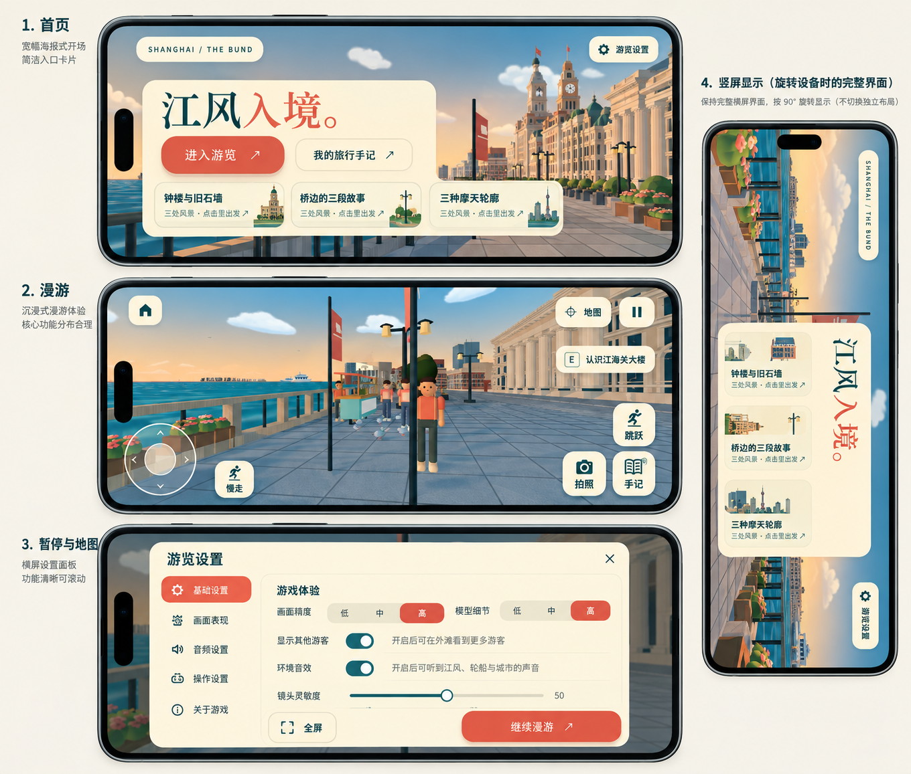
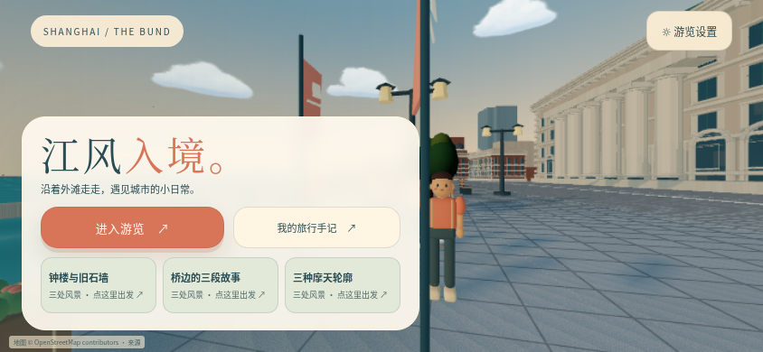
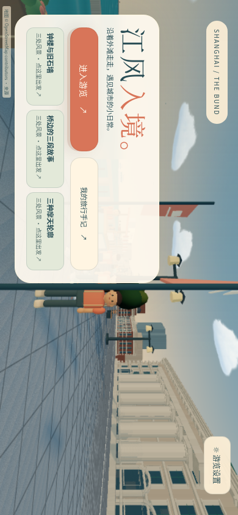
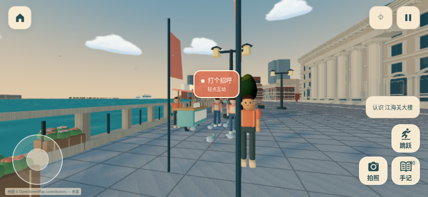
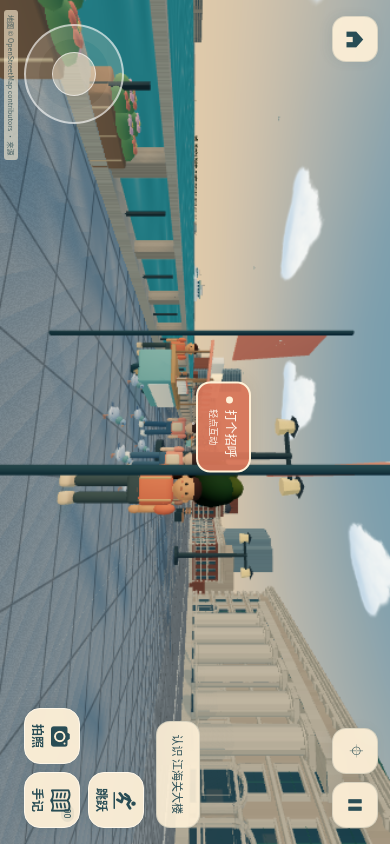
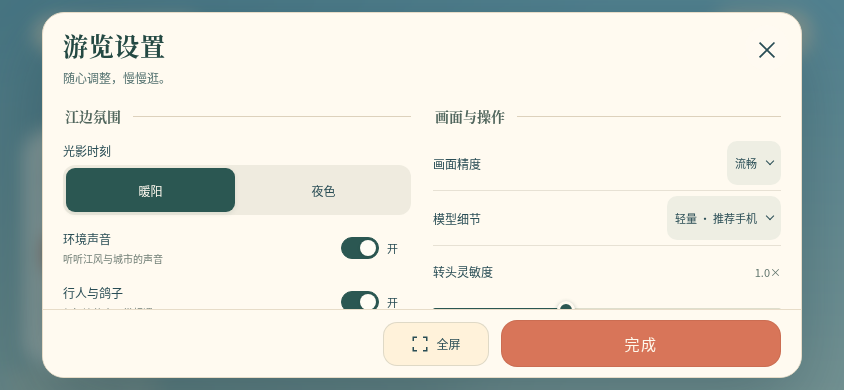
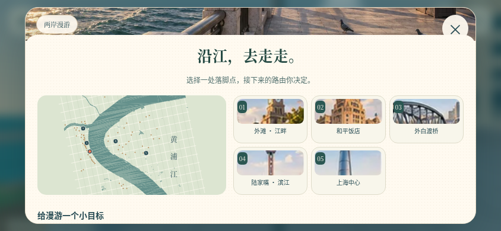

# 移动端横屏适配

保持现有外滩场景、奶油纸色、深青文字与珊瑚主按钮。首页、漫游、地图、设置、地标、手记与小摊统一使用横屏逻辑视口；手机竖屏时将完整界面顺时针旋转 90°，系统方向锁定或网页全屏不可用时仍可游玩。

## 效果图

效果图用于确定画面关系和触控分布。设置延续现有“江边氛围 / 画面与操作”两组，不新增图中的侧边标签；漫游延续快速摇杆移动，不恢复图中的速度切换按钮。实际界面仍由 HTML、CSS、SVG 与现有 3D 场景实现。

## 布局与交互

- 首页保留“进入游览”主操作、旅行手记与三条可出发路线。矮横屏中开始与手记并列，删减说明占用；更矮的视口缩小标题和卡片间距，必要时卡片可滚动。
- 漫游中央保留观察空间：左上返回、右上地图和暂停、左下摇杆、右下跳跃/拍照/手记。动作按钮保留文字和图标，主要触控热区至少 44 CSS px。
- 设置采用宽纸色面板，两组设置并列，页头、关闭、全屏和继续/完成固定可用，设置内容独立滚动；展开画质选项和帮助仍能滚到末尾。地图先展示两岸与落脚点，再展示三条探索路线；小摊礼物在横屏并列。
- 布局查询读取游戏容器的逻辑宽高，避免竖屏容器旋转后仍误用物理竖屏布局。场景、安全区、弹层和触控坐标使用同一方向映射；原生 `dialog` 在浏览器顶层单独旋转，保留模态语义和背景遮罩。
- 控件位置加上对应逻辑安全区。居中面板按两侧较大的安全区预留对称边距，避免单侧刘海与面板重叠。进入游戏时尝试全屏，设置提供进入/退出入口，拒绝时提供简短反馈并保留普通视口游戏。
- 同源 Shell 的沉浸样式由本游戏显示适配层提供，只作用于所属 iframe 的全屏宿主；退出全屏恢复外围导航，卸载或离开文档清理宿主样式、标记与监听。保持原有 iframe 权限和跨域边界。

## 实际运行检查

移动专项 `test:mobile`、多指控件 `test:controls`、路线 `test:routes` 和设置 `test:settings` 均通过；规则/物理/坐标测试 35 项通过，TypeScript 与生产构建通过。`mobile-report.json` 和 `controls-report.json` 记录真实 App、隔离渲染器下的触控和全屏验证，覆盖 320×480、320×568、390×844、844×390、方向锁定拒绝、全屏拒绝/不支持、同源与跨域 iframe、持指旋转、失焦及已开弹层的全屏切换，浏览器页面错误为 0。

`shell-fullscreen-report.json` 使用真实 Shell 生产构建和完整 3D 场景：手机点击进入后全屏目标为其所属 Shell MAIN，外围导航隐藏，iframe 铺满 390×844；地图、暂停与设置可触摸操作。退出全屏后导航恢复，位置、朝向、缩放、收藏和 Canvas 实例保留，页面错误和失败请求为 0。`dev-mode-report.json` 与 `dev-mode-cross-origin-report.json` 记录生产独立/Shell 的 URL、存储与显式关闭，以及该游戏同域继承和跨域显式传参检查。

CSS 布局检查使用 Linux Chromium、Vite 开发服务器、Playwright 手机视口与触摸模拟，覆盖 844×390、667×375、568×320 物理横屏，以及 390×844、320×568 竖屏下的旋转界面。主页主操作与三条路线均可见；设置面板无横向溢出，独立内容区域可滚至底部，关闭与页脚主操作保持在视口中。移动交互回归另外覆盖 320×480 的最小视口、真实触摸命中、全屏进入/退出和方向变化后的输入取消。

真实 3D 场景另由生产构建在 844×390 与 390×844 两个方向验证，检查相机与绘制缓冲区均使用相同的横屏逻辑比例，竖屏旋转后显示完整场景。完整生产场景报告见 `scene-visual-report.json`。桌面浏览器模拟不作为物理手机或 Safari 真机验证，也不能据软件渲染帧率推断手机 GPU 性能。

