# 外滩漫游：照片寻景

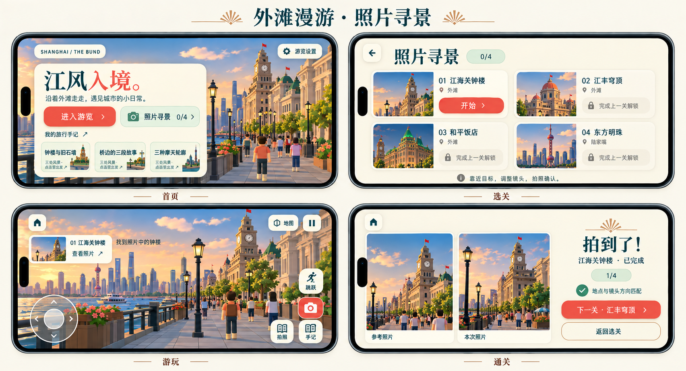

本轮在既有奶油纸色、深青文字、珊瑚按钮与薄荷色卡片中增加照片寻景玩法。先查看了 `../revision-2026-10-05/home.png` 与 `../revision-2026-10-05/tour-portrait.png`，随后依据最新 `../mobile-2026-10-06/concept.png` 与设计说明，统一改为横屏逻辑视口，沿用首页的实际场景预览。本图由内置 imagegen 参考以上截图与最新布局生成，是设计预览；实际游戏界面、材质和照片以本轮运行截图为准。生成图中的局部字形、建筑比例和重复动作图标仅作示意，实际游玩保留一个拍照入口与一个手记入口。首轮竖屏探索图保存在 `concept-portrait-revision.png`，不作为最终布局依据。

## 页面与操作

首页保留“进入游览”，增加独立的“照片寻景 0/4”入口，已完成数来自同一份存档。照片玩法与自由漫游共享城市与控件。

流程为：**首页 → 照片选关 → 关卡参考照片 → 游玩 → 通关 → 下一关 / 返回选关**。返回首页、返回选关和暂停必须清晰可用。通关只结算一次，并保存进度；重新打开游戏可继续尚未完成的关卡，也可重拍已完成关卡。

选关页按顺序展示四张照片卡：

| 顺序 | 关卡       | 初始状态       | 辨识线索                   |
| ---- | ---------- | -------------- | -------------------------- |
| 01   | 钟声入镜   | 可挑战         | 江海关钟面与高耸钟楼       |
| 02   | 石墙与柱廊 | 完成上一关解锁 | 原汇丰银行柱廊与宽阔石墙   |
| 03   | 绿色屋顶   | 完成上一关解锁 | 和平饭店绿色坡顶与层层装饰 |
| 04   | 隔江的明珠 | 完成上一关解锁 | 对岸东方明珠的圆球串与塔身 |

未解锁卡片保留地标缩略图与“完成上一关解锁”，不能进入挑战。已完成卡片显示完成状态，可重新进入。进入当前关卡先看完整参考照片和简短目标，再出发，避免只靠文字地标名完成寻景。

游玩顶部是小参考照片卡，能展开查看；场景仍占据主要空间。底部沿用左手移动摇杆、右侧转向与拍照触控。拍照后依据该关卡配置的地理区域、到地标的距离、镜头方向与可见性确认，不依赖生成图做相似度判定。尚未到位时提供简短的距离 / 转向提示，保留参考照片，不弹出连续面板。

通关页并排显示“参考照片”和“本次照片”，明确地点匹配结果、关卡名称与完成数。主要操作为“下一关”，次要操作为“返回选关”；最后一关完成后回到全部完成的选关页。

## 场景细节

历史建筑增加暖色石材拼缝、适度石块色差、窗框与窗棂、柱线和檐口阴影。和平饭店等近景补充克制的 Art Deco 扇纹与阶梯纹饰，优先让装饰在步行观察距离可辨认。保持现有低多边形城市与圆润游客风格，远景保留轮廓，装饰不覆盖窗户或钟面等寻景线索。参考卡片与通关页共用黄铜扇纹和纸色圆角。

## 手机横屏与竖屏旋转

最终效果图是四个 **844 × 390** 手机横屏画面，按 2 × 2 排列。首页、选关、参考照片、游玩、暂停和通关统一使用横屏逻辑视口；手机在 **390 × 844** 物理竖屏时沿用现有机制，将完整游戏容器顺时针旋转 90°，不切换成独立竖屏界面，也不阻塞系统方向锁定或全屏不可用时的游玩。

主要触控目标至少约 44 CSS px；选关在横屏采用四列卡片，小屏改为两列。参考页左侧照片、右侧说明与出发按钮；通关页上方并排照片、下方结果操作。矮屏内容可滚动，关闭和主要动作保持可用。参考卡缩小并放置左上，左右拇指控件加对应逻辑安全区，不遮挡钟楼。新增界面读取游戏容器逻辑宽高，沿用现有安全区、弹层与触控映射，旋转、进入 / 退出全屏不得重置关卡或丢失进度。

## 照片来源与实现验收

关卡参考照片由完整游戏城市场景从配置的相机位置和方向捕获，玩家照片在拍照时读取实际画布与最近绘制帧的相机姿态。效果图里的照片由 imagegen 合成，只表达版式和摄影玩法，**不作为地理位置确认素材或游戏实现的摄影证据**。拍摄目标模型未完成加载时提示稍等，不结算。

实景核对后，第二关从“穹顶”修正为“石墙与柱廊”：当前模型和江边视角中，柱廊是更清晰的辨识线索。和平饭店参考站位沿步道移动十米，避开正中遮住屋顶的灯杆。关卡稳定 ID 保留，存档和解锁链不变。

实现后补充生产构建的手机、横屏及关键操作截图，走通正常解锁、错误位置拍照、正确位置与角度通关、照片对比、下一关、返回选关、存档恢复和横竖屏切换。桌面浏览器的手机视口与触摸模拟不能称为真机验证。

## 实际界面与立面

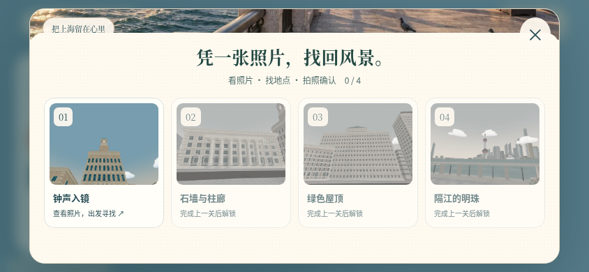

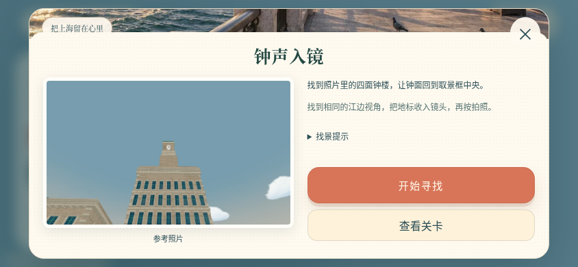

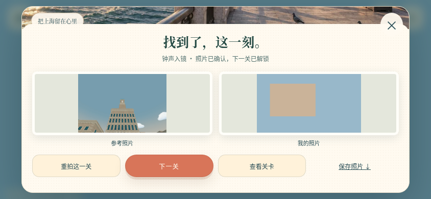

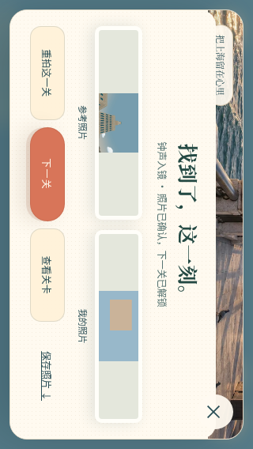

以上四张为真实 App 的触屏布局验收，Scene 被隔离：参考图仍是实际城市照片，右侧玩家照片由测试用的二维画布生成，用于确认 PNG、解锁和按钮流程，不能当作完整三维通关证据。

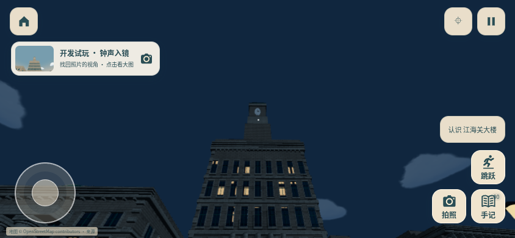

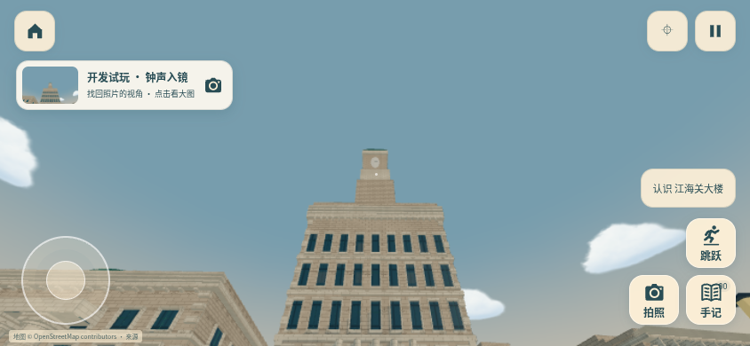

上述四张来自完整生产 Scene、实际城市 GLB 和 Rapier。Chromium 151、ANGLE SwiftShader，844 × 390 手机视口；原始和轻量两档的日夜着色均无着色器、页面或资源加载错误。

规则与真实物理测试 47 项通过，TypeScript 与 Vite 生产构建通过。真实 App 的触屏寻景回归覆盖 390 × 844 旋转兜底、844 × 390 横屏、320 × 568 小屏，以及锁关、提示、拍错位置/方向/仰角、空中拒绝、相机不可用、PNG 失败、四关解锁、重拍幂等、刷新恢复、存储拒绝续玩、开发试玩隔离和退出清理。成功结果不残留之前的失败提示，重拍与下一关无需滚动即可点击。既有 controls/routes 回归、开发者模式规则与一致性检查通过；最终生产包独立与 Shell 模式入口检查 10 项通过。记录见 `ui-browser-report.json`、`dev-mode-report.json` 与 `reference-capture-report.json`。尚未进行物理手机、Safari 或硬件 GPU 性能验收。

## 完整场景触屏通关

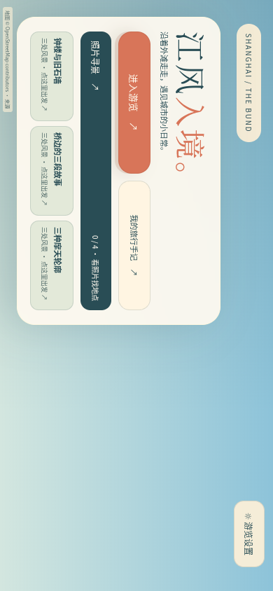

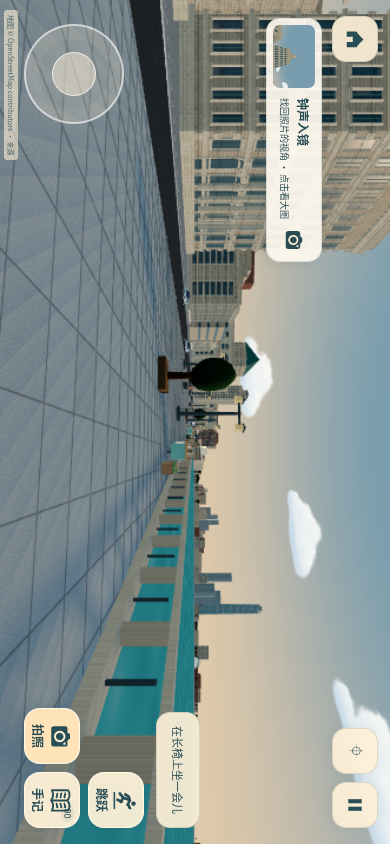

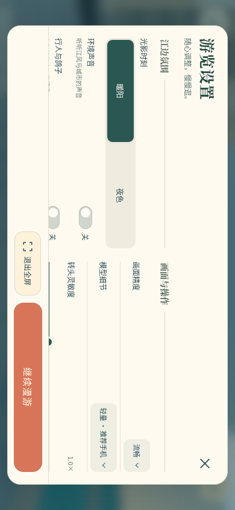

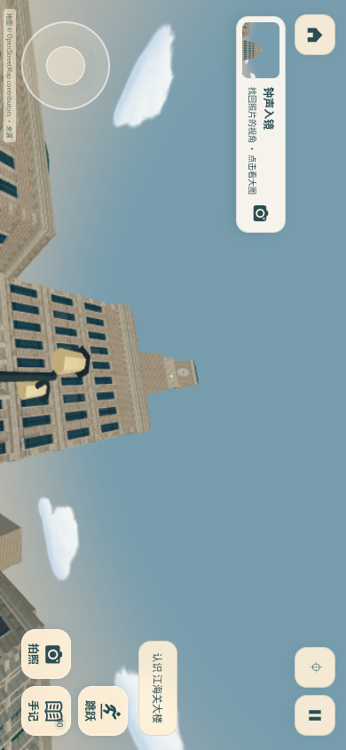

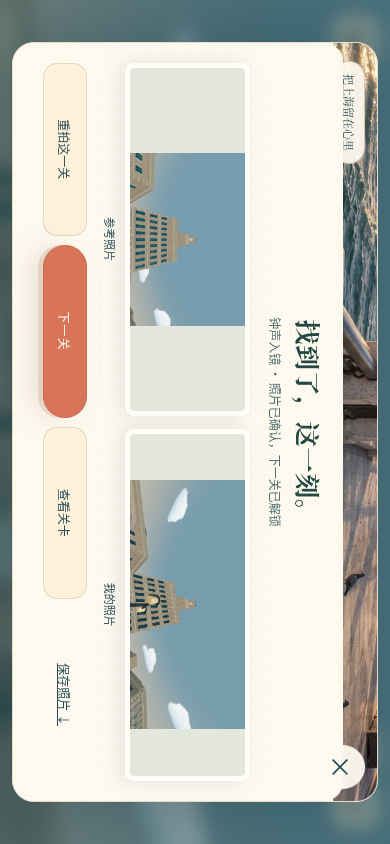

最后使用完整生产构建、真实城市模型与 Rapier，在 390 × 844 触屏视口的横屏旋转兜底下走通：首页、锁关目录、参考照片、起点拍照拒绝、暂停恢复、触屏摇杆行走、触屏转镜头、拍照通关、下一关与选关返回。整个通关过程未调用开发者站位动作，也未替换 Scene 或直接修改输入、镜头、进度；开发开关仅提供只读姿态诊断，正常关卡仍按正式规则结算。

首关从站位外出发，实际行走超过 70 米后停在合法拍摄区域，对准已加载且进入镜头的江海关钟楼。快门读取真实 WebGL PNG，保存 `completed: ["clock-tower"]`，第二关可进入、第三关保持锁定。此组实景截图与上面的隔离 Scene 界面测试分别记录，完整结果见 `full-scene-report.json`。着色器、页面、资源加载错误及 WebGL 警告均为零；仍属于 Chromium 软件 WebGL 和触屏模拟，未作真机性能声明。

## 生成记录

工具：内置 `image_gen.imagegen`。首轮参考图为前一轮首页与竖屏游览实际截图，随后读取最新横屏设计图更新最终方案。最终提示要求四个 844 × 390 手机横屏画面，2 × 2 排列：首页照片寻景入口、逐关解锁选关、钟楼街景与小参考卡、并排照片通关。配色使用奶油纸色、深青、珊瑚与薄荷色；建筑加石材拼缝、窗框和 Art Deco 扇纹；保留左摇杆和右侧跳跃、拍照、手记，以及地图和两根实心竖条的暂停图标。
