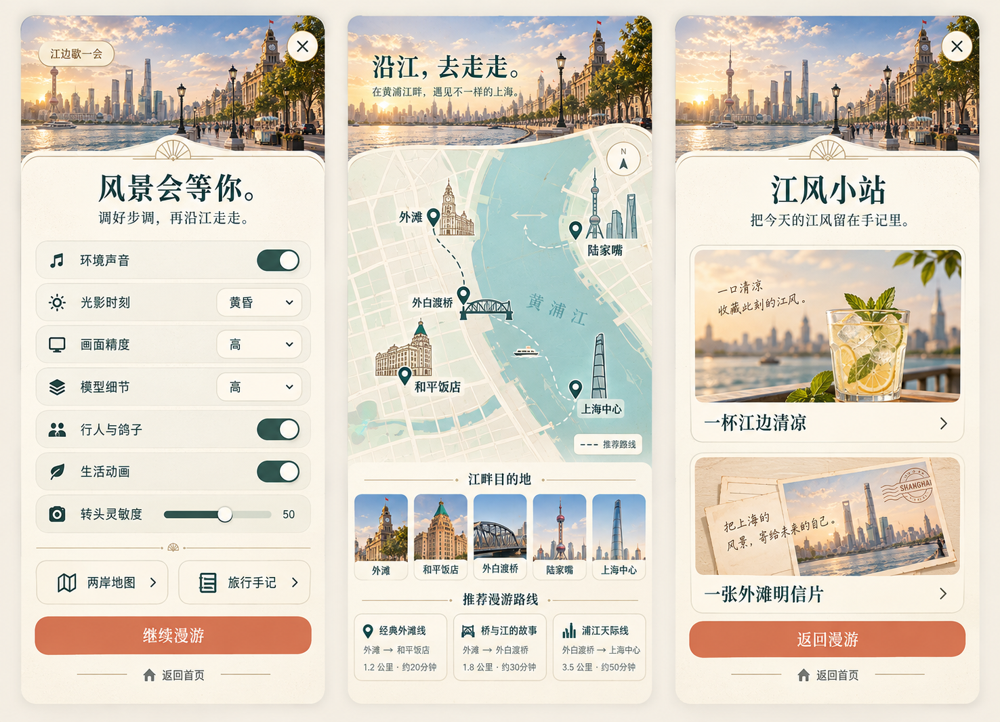
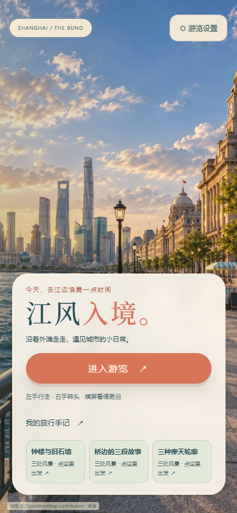
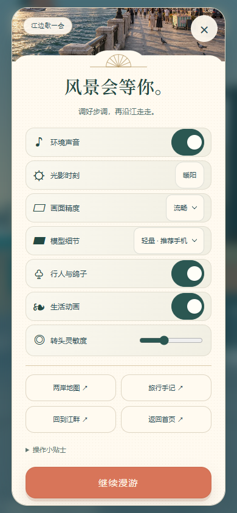
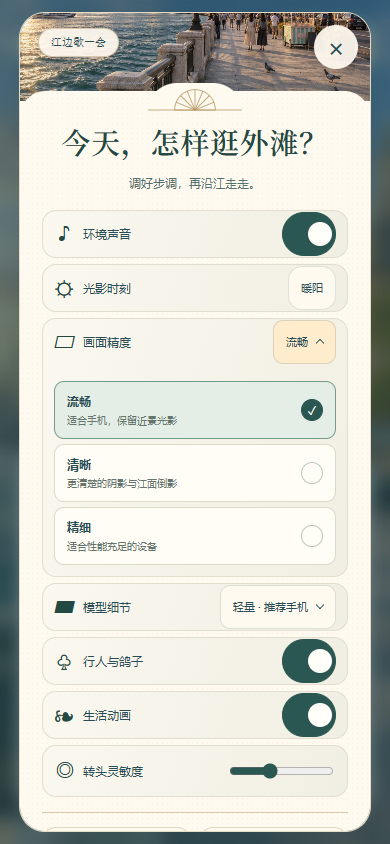
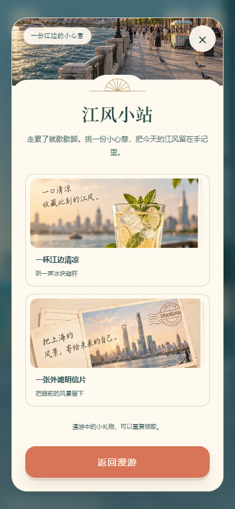
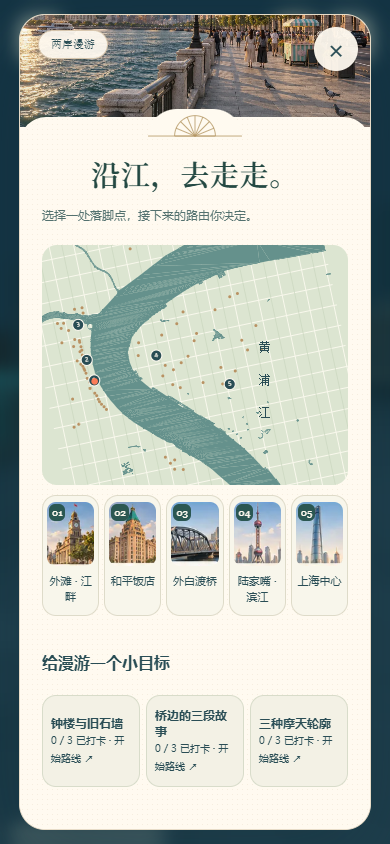
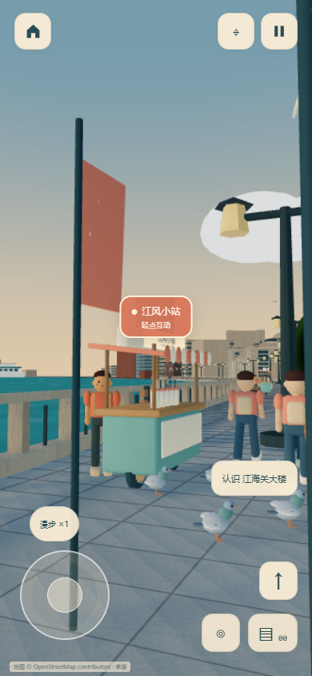
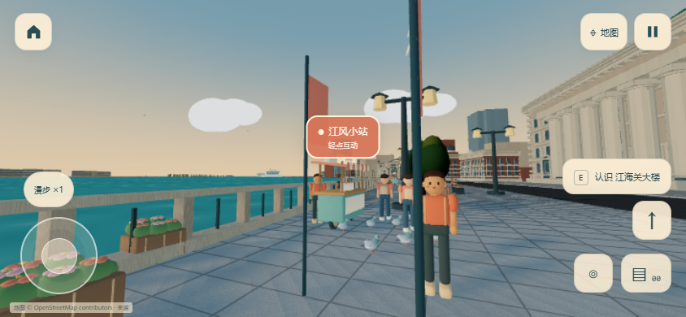
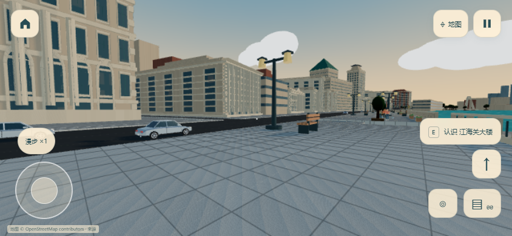
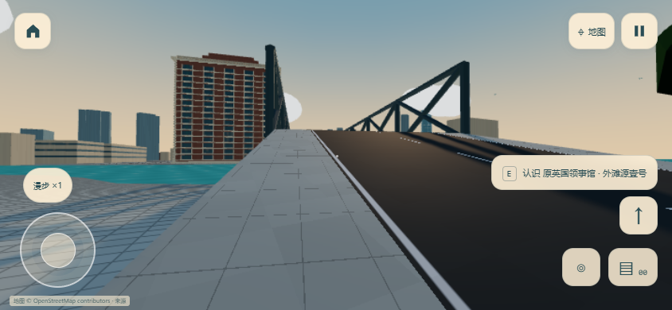

# 路面、岸线与手机面板修正

首页使用 302,092 字节的 WebP 背景，CSS 提供缓慢镜头、江面光影与微风。进入游览前不创建 Canvas，不请求 Scene/物理引擎、world.json 或 GLB。返回首页卸载 Canvas，再次进入复用已经下载的场景资源。“生活动画”与系统减少动态偏好控制首页动画。

## 面板效果图

暂停、地图、地标介绍、旅行手记与小摊共用景色横幅、纸色圆角、深青文字、黄铜扇纹和珊瑚按钮。画质和模型设置改为同风格的展开选项卡，包含勾选与简短说明，不调用浏览器原生下拉界面；支持触摸、方向键、Home/End、Esc 和点外部收起。触屏区域至少 44 像素，矮屏面板可滚动。礼物图片复用生成美术，按钮保留独立、可访问的名称。

## 游戏内修正

- 柏油路使用深灰粗糙表面；滨江步道使用灰色花岗岩石板、细接缝、轻微色差和近处颗粒，取消厚白线网格。颗粒在远处衰减，不增加贴图下载。
- 移除道路分段端头的石板封口，柏油路段重叠 0.25 米，消除截图中的横向凸条。Blender 源模型、运行步道分块与碰撞一并重建。
- 外白渡桥取消重复的低位道路，桥墩落地，两端改为完整实体坡道。可见桥面与碰撞顶部同为 5.6 米，两端步行上桥均通过实际物理验证。
- 建筑石材降低过白的基色响应，补充轻微颗粒、暖色侧光和近景投影。合批建筑使用标准粗糙度材质，区分石材与窗户反射；树木也投影。手机流畅档使用一张 512 像素局部阴影图，保持模型懒加载。
- 水面从栏杆外侧连续延伸至地图水域，覆盖原岸线留下的陆地条带。显示与禁止行走共用水域；跳过栏杆也不能落入这条区域。桥面仍可以通过。
- 每位附近游客有随位置移动的 Rapier 实体胶囊。正面接近会停住，斜向碰撞可以沿侧面绕开。关闭人群、离开片段或返回首页清理实体。仍只加载附近 75 米内最多五个生活片段。
- 场景提示按下时保留目标并捕获手指，松手后响应；弹窗在下一帧打开，避免同一次触摸误领礼物。取消不会触发互动。

首页与面板的生成图片是二维美术；游览截图来自生产构建。既有城市模型与圆润角色继续用于游戏，不能将二维图片当作实现了照片写实的证据。

## 实际运行画面

## 继续贴近效果图

目前差距主要是材质和近景细节：生成图片含有真实石材纹理、窗框遮蔽、细密树叶和柔和间接光，现有 GLB 多为纯色程序化模型。仅增加灯光会继续冲淡立面。

下一步优先给步行可见的历史建筑立面做 UV，将基础色、法线与环境遮蔽从 Blender 烘焙到共用贴图，再逐块替换近景 GLB；远景继续沿用合批轮廓与距离/视野懒加载。树冠以少量叶片簇替换大块体，保持实例绘制。贴图和更细模型也应随附近分块下载。完整城市照片级重建与新贴图烘焙尚未实施，本轮不将光照改善表述为照片写实。

## 验证

规则测试增加正面漫步/疾行撞人、移动及移除障碍、栏杆外原陆地区域禁止行走。完整场景测试覆盖首屏零 3D 请求、无 Canvas、提示取消、小摊赠礼、实际挥手/起飞、实体碰撞、返回首页卸载、再次进入、关闭人群清理实体、横竖屏与开发者模式。

报告在根目录 `.scratch/travel-bund-life/` 与 `.scratch/travel-bund-browser/`，本目录保留完整场景报告。Windows Chrome 手机视口、CDP 触摸模拟，尚未做物理手机与 Safari 验证。规则/物理测试 27 项、统一开发者模式规则 5 项通过；完整场景、控件和路线回归通过，浏览器/着色器错误为 0。连续触摸行走接近游客至约 0.606 米，65 次位置采样无实体重叠；正面撞人与疾行阻挡另由物理规则测试验证。Blender 检查 93 个 GLB、三个源文件及六张既有预览通过。

## 图像提示记录

工具：内置 imagegen。首页为新生成，面板引用首页美术。WebP 仅做格式转换；运行界面由 HTML、CSS、SVG 和现有游戏组件实现。

首页提示：为上海外滩手机漫游制作竖屏背景，无文字、无界面。海关钟楼和历史建筑在右侧，对岸陆家嘴在左侧，黄浦江紧贴石栏杆，没有沙滩。真实比例的灰色花岗岩步道、深灰柏油路、温暖阳光、白云、绿树、小规模行人与薄荷条纹小车，用于轻量首页的缓慢镜头和水面光影动画。

面板提示：引用首页美术，制作暂停、两岸地图、小摊三份手机弹窗设计。奶油纸色、深青文字、黄铜 Art Deco 扇纹、珊瑚按钮、景色顶部与关闭键。暂停标题“风景会等你”，紧凑开关、原生选择框、滑条；地图有青色黄浦江、地标与路线卡；小摊有饮料与明信片照片卡。结构可以用 HTML/CSS/SVG 实现，保留足够触屏区域。
