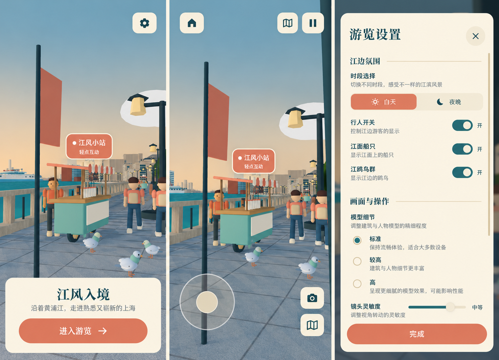
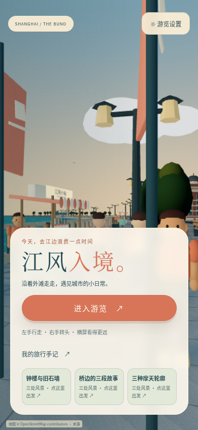
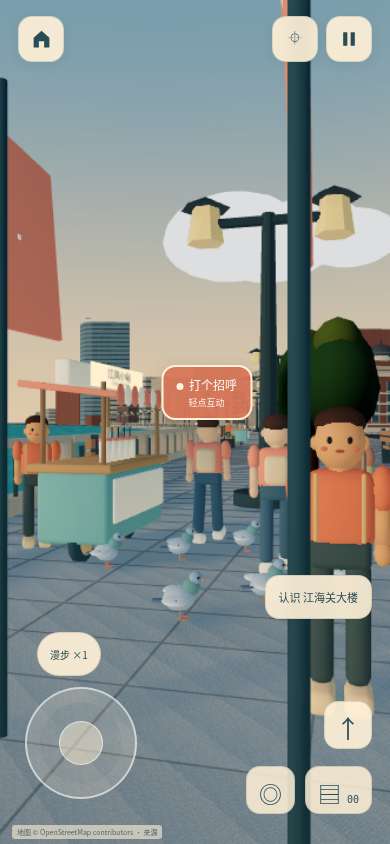
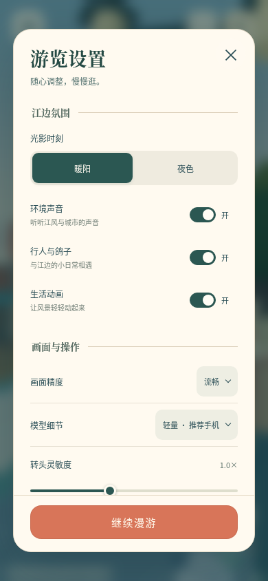
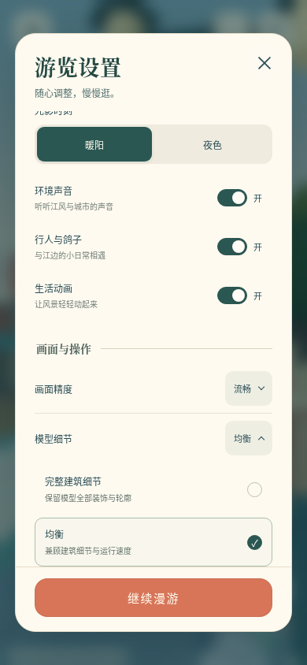

# 设置交互与实际场景预览

沿用现有奶油纸色、深青文字和珊瑚主按钮。局部效果图先以既有实际 3D 截图为参考生成，不引入照片写实建筑或未实现功能。实现只保留现有可用的声音、时刻、人群、动画、画质、模型和镜头设置；图中独立船只/鸽群开关不作为本轮实现要求。

## 页面与操作

- 设置由首页“游览设置”和游览中“暂停”手动打开。去掉设置横幅、装饰扇纹与地图/手记/传送链接，用“江边氛围”和“画面与操作”两组组织内容，保持每页任务清楚。
- 小型开关提供明确开/关状态与 `switch` 语义，44px 点击区域；暖阳/夜色为直接选择的分段按钮。模型与画质使用同风格的说明卡，点击后只更新选中项，保留展开区域与焦点，可连续比较。方向键、Home/End、Esc 和点外部收起继续有效。
- 仅中间内容滚动，细暖灰滚动条融入纸色。关闭和完成/继续按钮固定，横屏和 320px 小屏滚动到底仍能退出。地图、手记、地标和小摊也改为内容内滚动，关闭按钮保留在顶部。
- Esc 释放鼠标并清空当前输入，场景和工具保持可用，按住场景拖动仍可环顾；“鼠标环顾”按钮显式重新锁定。关闭面板后保留可自由点击的鼠标，不自动重新锁定。窗口失焦/隐藏暂停输入、物理和声音，只显示继续入口，不自动弹出设置。
- 首页和游览共用实际 `Tour`、镜头、质量与资源。初次打开加载附近城市；加载中首页仍可进入设置或选择路线。进入没有插画到 3D 的切换，返回首页保留当前视点并暂停模拟、按需渲染。原有图片首页的“零 3D 请求”和“返回卸载 Canvas”已不适用于此版本，资源下载增加是保持预览真实的明确取舍；附近分块懒加载仍保留。
- 生活模型显式使用同源 `draco/`，与城市模型一致，避免共享 GLTFLoader 被默认外部解码器地址覆盖。

## 实际运行截图

横屏记录见同目录的 `home-844.png`、`playing-844.png`、`settings-844.png` 和 `choices-844.png`。

## 验证

Linux Chromium、390×844 / 844×390 / 320×568 触屏模拟；完整 3D 使用软件 WebGL，没有实体手机或 Safari 验证，不声称帧率达标。

- 27 项规则、真实 GLB 和物理测试通过；TypeScript 与生产构建通过。
- `test:controls`：横竖屏三指所有权、捕获丢失、触摸取消、手动暂停恢复、画质与模型连续切换通过。
- `test:routes`：收藏、公开邀请参数、存档、真实纪念卡下载、分享取消和异步过期保护通过。
- `test:settings`：真实 App、隔离 3D，原生 Pointer Lock 的独立/iframe Esc 释放、释放后拍照/手记点击、手动设置、选项保持展开、失焦恢复，以及三种手机尺寸的固定关闭/完成通过。记录见 `settings-report.json`。
- 完整 3D 的新版针对性验收由 `test:preview` 复现，覆盖实际预览镜头与 Canvas 一致、横竖屏行走/转头/取消、设置、拍照手记、返回首页模拟暂停及再次进入；记录见 `visual-report.json`。
- 既有 `test:life` 本次未全部通过：软件 WebGL 下，5 秒窗口内鸽子起飞高度未到达原断言，同时首次运行发现外部 Draco 请求失败。解码器已改为同源并在新版预览验收中检查外部请求；不将新版针对性验收表述为完整旧脚本通过。未重复完成 `test:browser` 全部跳跃/疾行与五处目的地场景。

## 图像生成记录

内置 imagegen 引用之前的 `revision-2026-10-05/tour-portrait.png`，生成三屏局部设计板：现有低面 3D 首页、相同场景的游览、无横幅的纸色分组设置；紧凑开关、保留说明的模型选项、细滚动条与固定完成按钮。实际界面用 React/CSS/SVG 实现。生成图是设计参考，实际截图与浏览器报告才是验收证据。
